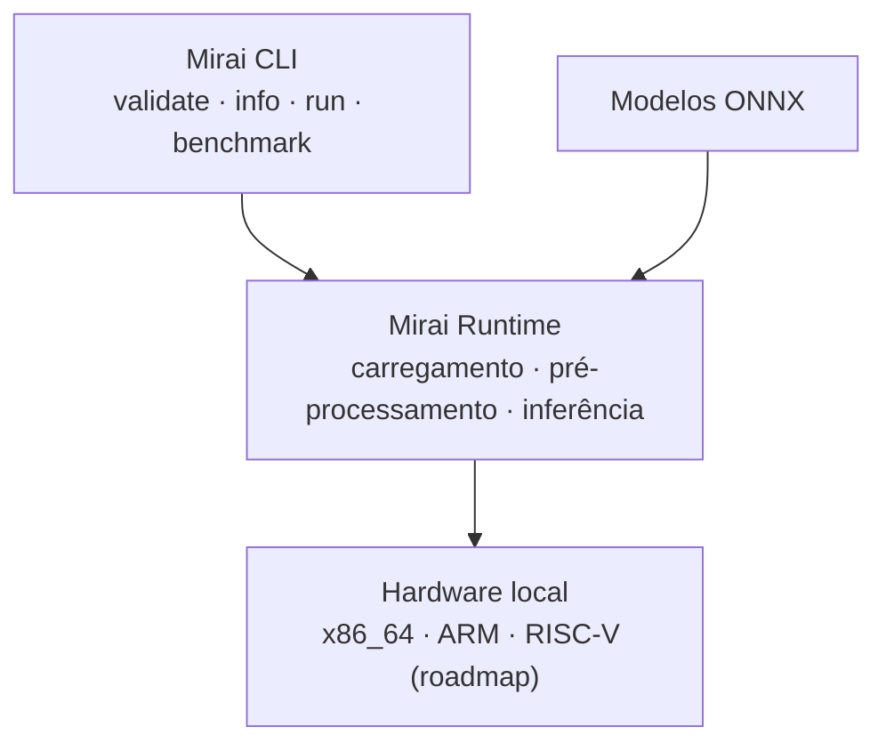

<div align="center">

# 🚀 MiraiOS

### The Future Runs Local

Framework enxuto para validar, inspecionar e executar modelos de IA em
dispositivos de borda.

[](https://pypi.org/project/miraios/)
[](#-status-do-projeto)
[](#-projeto-hikari)
[](LICENSE)

[Instalação](#-instalação) •
[Comandos](#-mirai-cli) •
[Roadmap](#-roadmap) •
[Contribuição](#-como-contribuir)

</div>

---

## 🌐 Sobre

O **MiraiOS** é um framework open-source criado para simplificar a validação,
a inspeção, a execução e o benchmark de modelos de Inteligência Artificial em
dispositivos de borda — **Edge AI**.

Seu objetivo é conectar modelos no formato **ONNX** ao hardware local de forma
rápida, eficiente e com o mínimo de complexidade operacional.

> Execute IA onde os dados são gerados.

Ao reduzir a dependência da nuvem, o MiraiOS busca viabilizar aplicações com:

- ⚡ menor latência;
- 🔒 maior privacidade;
- 📡 operação offline;
- 💰 menor custo de infraestrutura;
- 🧩 integração simplificada entre modelos e hardware;
- 🌱 uso eficiente dos recursos computacionais.

---

## ✨ Visão

Construir uma camada enxuta, portátil e extensível para tornar a execução local
de modelos de IA mais acessível em diferentes dispositivos e arquiteturas.

O MiraiOS oferece uma experiência unificada para inspecionar tensores, validar
modelos, executar inferências e medir o desempenho do hardware local.

---

## 🚧 Status do projeto

O MVP do MiraiOS está ativo e disponível como pacote Python.

| Item | Estado |
| --- | --- |
| Projeto | Hikari |
| Fase | MVP |
| Versão atual | v0.5.0 |
| Distribuição | 🟢 Publicado no PyPI |
| Licença | MIT |

> O projeto continua em evolução. A interface da CLI e as funcionalidades do
> runtime podem receber ajustes entre versões do MVP.

---

## 🏗️ Arquitetura

O fluxo atual do MiraiOS conecta a interface de linha de comando, o runtime
local, os modelos ONNX e o hardware de destino.



### 🧰 Mirai CLI

A CLI concentra as operações essenciais do ciclo local de um modelo:

| Comando | Descrição |
| --- | --- |
| `mirai init` | Inicializa o ambiente local do Projeto Hikari. |
| `mirai validate modelo.onnx` | Verifica a existência e a extensão do modelo. |
| `mirai info modelo.onnx` | Exibe entradas, saídas, shapes, tipos e nós do grafo. |
| `mirai run modelo.onnx --input 5.0` | Executa uma inferência com entrada numérica. |
| `mirai run modelo.onnx --input foto.png` | Executa uma inferência com imagem compatível. |
| `mirai benchmark modelo.onnx --runs 50` | Mede latência e inferências por segundo. |

---

## 🚀 Instalação

Recomenda-se utilizar um ambiente virtual:

```bash
python -m venv .venv
```

Ative o ambiente no Linux ou macOS:

```bash
source .venv/bin/activate
```

No Windows PowerShell:

```powershell
.venv\Scripts\Activate.ps1
```

Instale ou atualize o MiraiOS pelo PyPI:

```bash
python -m pip install --upgrade miraios
```

Confirme a instalação:

```bash
mirai --version
```

---

## ⚡ Uso rápido

### Inspecionar um modelo

```bash
mirai info seu_modelo.onnx
```

O comando apresenta as entradas e saídas do modelo, incluindo nomes, shapes,
tipos de dados e o número total de nós no grafo computacional.

### Validar um arquivo ONNX

```bash
mirai validate seu_modelo.onnx
```

### Executar uma inferência numérica

```bash
mirai run seu_modelo.onnx --input 5.0
```

### Executar uma inferência com imagem

Para modelos compatíveis com entrada de imagem:

```bash
mirai run seu_modelo.onnx --input foto.jpg
```

### Medir o desempenho local

```bash
mirai benchmark seu_modelo.onnx --runs 100
```

O benchmark informa:

- tempo total de execução;
- latência média por inferência;
- estimativa de inferências por segundo (FPS/IPS).

---

## 🗺️ Roadmap

### Projeto Hikari — MVP v0.5.0

- [x] Definir a arquitetura inicial.
- [x] Criar a estrutura base do pacote em `src/mirai`.
- [x] Validar arquivos e extensões `.onnx`.
- [x] Inspecionar entradas, saídas e nós com `mirai info`.
- [x] Executar inferências locais com `mirai run`.
- [x] Adicionar pré-processamento de imagens `.jpg` e `.png`.
- [x] Medir latência e vazão com `mirai benchmark`.
- [x] Publicar o pacote no PyPI.

### Próximas versões

- [ ] Adicionar aceleração por GPU com CUDA e DirectML.
- [ ] Exportar relatórios de benchmark em JSON.
- [ ] Detectar automaticamente o hardware local.
- [ ] Ampliar a compatibilidade com ARM.
- [ ] Adicionar suporte experimental a RISC-V.

---

## 📁 Estrutura do projeto

```text
MiraiOS/
├── src/
│   └── mirai/
│       ├── __init__.py
│       └── main.py          # CLI e runtime
├── scripts/
│   └── create_dummy_model.py
├── examples/
│   └── dummy_model.onnx
├── tests/                   # Testes automatizados
├── pyproject.toml           # Metadados, dependências e entry point
├── LICENSE                  # Licença MIT
└── README.md                # Visão geral e documentação
```

---

## 🤝 Como contribuir

Contribuições são bem-vindas:

1. Faça um fork do repositório.
2. Crie uma branch para a alteração:

   ```bash
   git checkout -b feat/minha-funcionalidade
   ```

3. Implemente e teste sua mudança.
4. Registre um commit objetivo:

   ```bash
   git commit -m "feat: adiciona nova funcionalidade"
   ```

5. Envie a branch:

   ```bash
   git push origin feat/minha-funcionalidade
   ```

6. Abra um Pull Request explicando o problema, a solução e como validar a
   alteração.

Você também pode contribuir relatando bugs, sugerindo funcionalidades,
melhorando a documentação ou adicionando suporte a novos dispositivos.

---

## 📄 Licença

Distribuído sob a licença **MIT**. Consulte o arquivo [LICENSE](LICENSE) para
mais informações.

---

## 🌅 Projeto Hikari

**Hikari** representa a primeira etapa do MiraiOS: um MVP focado em validar os
fundamentos do framework e sua integração entre modelos ONNX e hardware local.

> Pequeno no runtime. Grande no futuro.

---

<div align="center">

**MiraiOS — The Future Runs Local**

Feito para levar a Inteligência Artificial além da nuvem. 🚀

</div>
