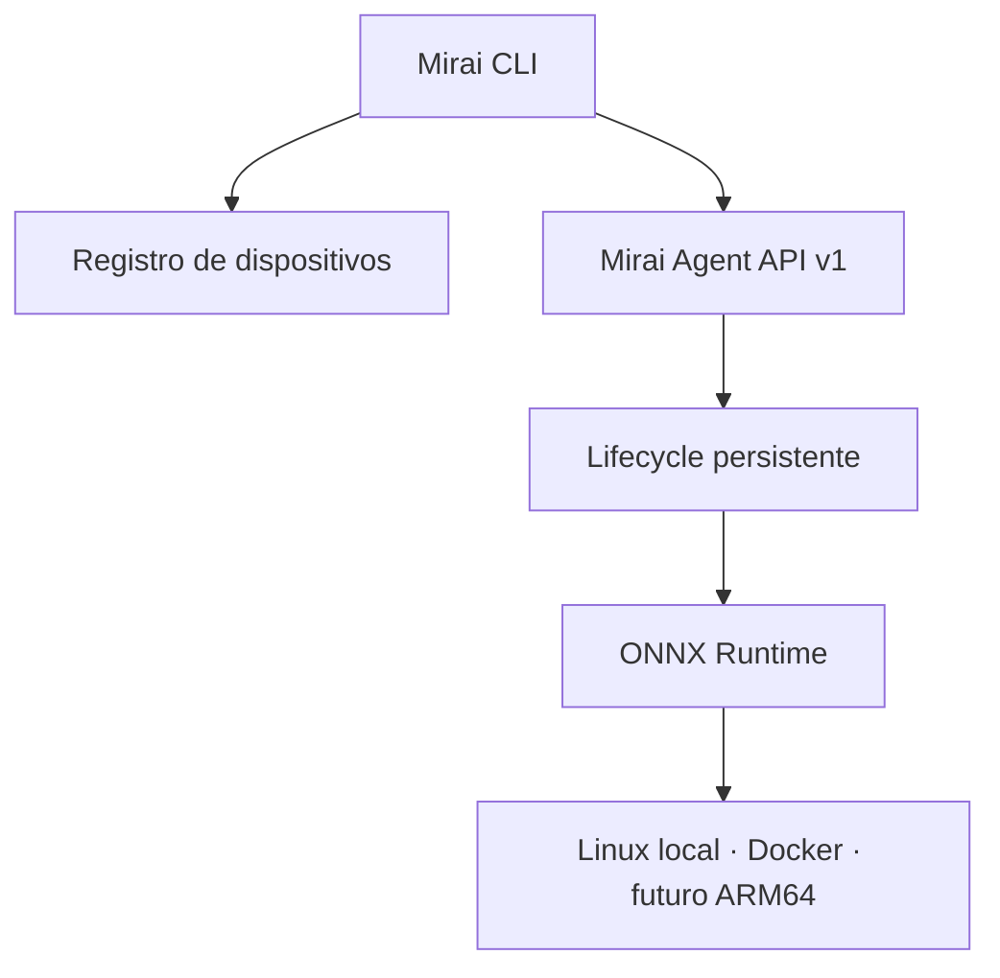

<div align="center">


<br>

[](https://github.com/start6202783-dotcom/MiraiOS/actions/workflows/ci.yml)
[](https://pypi.org/project/miraios/)
[](pyproject.toml)
[](LICENSE)
[](https://onnxruntime.ai/)

**Uma camada operacional local-first para implantar, executar e observar IA
em dispositivos Edge.**

[Começar](#comece-em-3-minutos) ·
[Demonstração](#o-fluxo-da-v07) ·
[Arquitetura](#arquitetura) ·
[CLI](#comandos) ·
[Roadmap](#roadmap)

</div>

## O que é o MiraiOS?

O **MiraiOS** é um projeto open-source do **Projeto Hikari** que conecta
modelos ONNX a dispositivos Linux por um fluxo simples e reproduzível:

```text
modelo → deploy → validação → ativação → inferência → resultado + métricas
```

A CLI permanece no computador do desenvolvedor. O **Mirai Agent** roda no
destino, verifica o modelo, mantém o lifecycle dos deployments e executa a
inferência. O primeiro destino pode ser o próprio computador ou um container;
o protocolo foi separado do hardware para evoluir depois para ARM64 e placas
Edge sem exigir uma Raspberry Pi durante o desenvolvimento.

> **Do arquivo ONNX ao dispositivo físico em um único fluxo.**

## O fluxo da v0.7


A v0.7 fecha o primeiro ciclo operacional completo do projeto:

| Etapa | O que acontece |
| --- | --- |
| **Discover** | A CLI consulta sistema, arquitetura, CPU, memória e providers. |
| **Deploy** | O modelo é enviado com SHA-256, validado e aberto no runtime. |
| **Activate** | Um deployment `ready` se torna o único modelo `active`. |
| **Run** | A CLI envia entradas ao Agent e recebe resultado e latência. |
| **Observe** | Deploys, ativações, sucessos e falhas viram eventos persistentes. |

O estado ativo e os modelos sobrevivem à reinicialização do Agent.

## Por que este projeto existe

- **Local-first:** a inferência acontece onde o dado é produzido.
- **Sem hardware obrigatório:** Linux local e Docker validam o protocolo antes
  da compra de uma placa.
- **Lifecycle explícito:** receber um arquivo não significa ativá-lo; cada
  transição é intencional e observável.
- **Formato aberto:** ONNX reduz o acoplamento a um framework de treinamento.
- **Base pequena e auditável:** CLI, cliente HTTP, Agent e runtime são módulos
  Python independentes, sem framework web obrigatório.

## Status atual

| Capacidade | v0.7 |
| --- | --- |
| Validação estrutural com `onnx.checker` | Pronto |
| Inferência local numérica, JSON e imagens | Pronto |
| Benchmark com warm-up, mediana, P95 e IPS | Pronto |
| Registro de dispositivos | Pronto |
| Deploy com verificação SHA-256 | Pronto |
| Lifecycle persistente `ready` / `active` | Pronto |
| Inferência remota numérica e JSON | Pronto |
| Eventos e métricas de inferência | Pronto |
| Imagens em inferência remota | Ainda não |
| Autenticação e pareamento | Ainda não |
| Provider validado no CI | ONNX Runtime CPU |

O projeto está em estágio **alpha**. A API v0.7 é destinada a desenvolvimento
local e não deve ser exposta diretamente à internet.

## Arquitetura



O Agent usa armazenamento simples e inspecionável:

| Item | Função |
| --- | --- |
| `models/` | Modelos ONNX validados e identificados pelo hash. |
| `deployments.json` | Deployments, estados e seleção ativa. |
| `events.jsonl` | Histórico de deploys, ativações e inferências. |

A especificação do marco está em
[Projeto Hikari v0.7](docs/hikari-v0.7.md).

## Comece em 3 minutos

### 1. Instale a versão do repositório

O MiraiOS requer Python 3.10 ou superior:

```bash
git clone https://github.com/start6202783-dotcom/MiraiOS.git
cd MiraiOS
python -m venv .venv
```

Ative o ambiente no Linux ou macOS:

```bash
source .venv/bin/activate
python -m pip install --editable ".[dev]"
```

No Windows PowerShell:

```powershell
.venv\Scripts\Activate.ps1
python -m pip install --editable ".[dev]"
```

Também é possível instalar a versão publicada:

```bash
python -m pip install --upgrade miraios
```

### 2. Inicie um Agent

No primeiro terminal:

```bash
mirai agent start
```

Por segurança, o endereço padrão é `http://127.0.0.1:8080`.

### 3. Faça deploy, ative e execute

No segundo terminal:

```bash
python scripts/create_dummy_model.py
mirai device add local --url http://127.0.0.1:8080
mirai device info local
mirai deploy examples/dummy_model.onnx --device local
mirai status --device local
mirai activate 153f2947c78a0313 --device local
mirai run --device local --input 5.0
mirai logs --device local
```

O modelo de exemplo soma `1` à entrada, portanto o resultado esperado é
`6.0`. Para outro modelo, use no comando `activate` o identificador exibido
por `mirai deploy`.

## Comandos

| Comando | Descrição |
| --- | --- |
| `mirai validate modelo.onnx` | Valida integralmente o protobuf ONNX. |
| `mirai info modelo.onnx` | Exibe entradas, saídas, tipos, shapes e nós. |
| `mirai run modelo.onnx --input 5` | Executa inferência local. |
| `mirai benchmark modelo.onnx` | Mede latência, P95 e vazão local. |
| `mirai agent start` | Inicia o Agent no dispositivo. |
| `mirai device add/list/info/remove` | Gerencia destinos. |
| `mirai deploy modelo.onnx --device edge` | Envia e valida um modelo. |
| `mirai status --device edge` | Lista deployments e o modelo ativo. |
| `mirai activate ID --device edge` | Ativa um deployment pronto. |
| `mirai run --device edge --input 5` | Executa no deployment ativo. |
| `mirai logs --device edge` | Consulta eventos recentes. |

Execute `mirai COMANDO --help` para ver todas as opções.

## Entradas e inferência

### Local

Escalares e arrays JSON são convertidos para o dtype e o shape esperados:

```bash
mirai run modelo.onnx --input 5.0
mirai run modelo.onnx --input "[[1, 2, 3]]"
```

Modelos com múltiplas entradas aceitam nome ou ordem:

```bash
mirai run soma.onnx --input x=5 --input y=7
mirai run soma.onnx --input 5 --input 7
```

Imagens NCHW e NHWC são suportadas localmente:

```bash
mirai run visao.onnx --input foto.jpg --layout auto
```

O pré-processamento de visão é intencionalmente básico. Modelos que exigem
mean/std, letterbox, BGR ou tokenização ainda precisam receber tensores
preparados externamente.

### No Agent

A inferência remota da v0.7 aceita escalares, arrays JSON e entradas nomeadas:

```bash
mirai run --device edge --input 5
mirai run --device edge --input x=5 --input y=7
```

Caminhos de imagens são rejeitados no Agent nesta versão. Isso evita que uma
requisição tente ler arquivos arbitrários do dispositivo antes de existir um
protocolo seguro de upload de entradas.

## Benchmark local

```bash
mirai benchmark modelo.onnx --runs 100 --warmup 5
```

O carregamento do modelo não entra na medição. O relatório inclui tempo total,
latência média, mediana, percentil 95 e inferências por segundo.

## Docker: dispositivo sem placa física

O repositório inclui um Agent isolado em container:

```bash
docker compose up --build -d
mirai device add docker --url http://127.0.0.1:8080
mirai device info docker
```

O volume `mirai-agent-data` preserva modelos, lifecycle e eventos. Para
encerrar:

```bash
docker compose down
```

## Segurança da v0.7

O Agent ainda não implementa autenticação, autorização ou TLS próprio.

- escuta apenas em `127.0.0.1` por padrão;
- limita modelos a 512 MB e corpos JSON a 1 MB;
- sanitiza nomes e verifica o SHA-256 antes da validação;
- rejeita caminhos de imagens em requisições remotas;
- não deve ser publicado na internet nem usado em uma rede não confiável.

Pareamento e autenticação são o próximo requisito arquitetural, não um detalhe
opcional de produção.

## Roadmap

### Entregue

- [x] **v0.5.1 — Runtime:** validação real, inferência, imagens, benchmark,
  testes e CI.
- [x] **v0.6 — Deploy:** Agent, registro de dispositivos, upload verificado,
  logs e Docker.
- [x] **v0.7 — Operação:** lifecycle persistente, ativação, inferência remota
  e métricas.

### Próximo

- [ ] Pareamento e autenticação entre CLI e Agent.
- [ ] Pacote reproduzível `.mirai` com metadados e pré-processamento.
- [ ] Health check por modelo, rollback e histórico de ativações.
- [ ] Saída JSON para automação e relatórios de benchmark.

### Depois

- [ ] Descoberta de dispositivos e visão de frota.
- [ ] Seleção explícita de providers e perfis de hardware.
- [ ] Compatibilidade validada em ARM64.
- [ ] Providers CUDA e DirectML.
- [ ] Suporte experimental a outros runtimes e RISC-V.

O roadmap prioriza um protocolo seguro e útil antes de ampliar a quantidade de
hardwares suportados.

## Desenvolvimento

Instale as dependências de desenvolvimento e execute a suíte:

```bash
python -m pip install --editable ".[dev]"
python -m compileall -q src tests scripts
python -m pytest
```

O CI executa os testes em Python 3.10, 3.11, 3.12 e 3.13. Consulte
[CONTRIBUTING.md](CONTRIBUTING.md) antes de enviar mudanças.

Os ativos visuais do README são reproduzíveis:

```bash
python scripts/render_readme_assets.py
```

## Projeto Hikari

**Hikari** é a primeira fase do MiraiOS: construir uma camada pequena,
portátil e verificável entre modelos de IA e hardware local. O nome Mirai
significa “futuro”; Hikari, “luz”.

Documentação dos marcos:

- [v0.6 — Mirai Agent](docs/hikari-v0.6.md)
- [v0.7 — lifecycle e inferência remota](docs/hikari-v0.7.md)
- [Changelog completo](CHANGELOG.md)

## Licença

Distribuído sob a [licença MIT](LICENSE).

<div align="center">


**The Future Runs Local**

</div>
