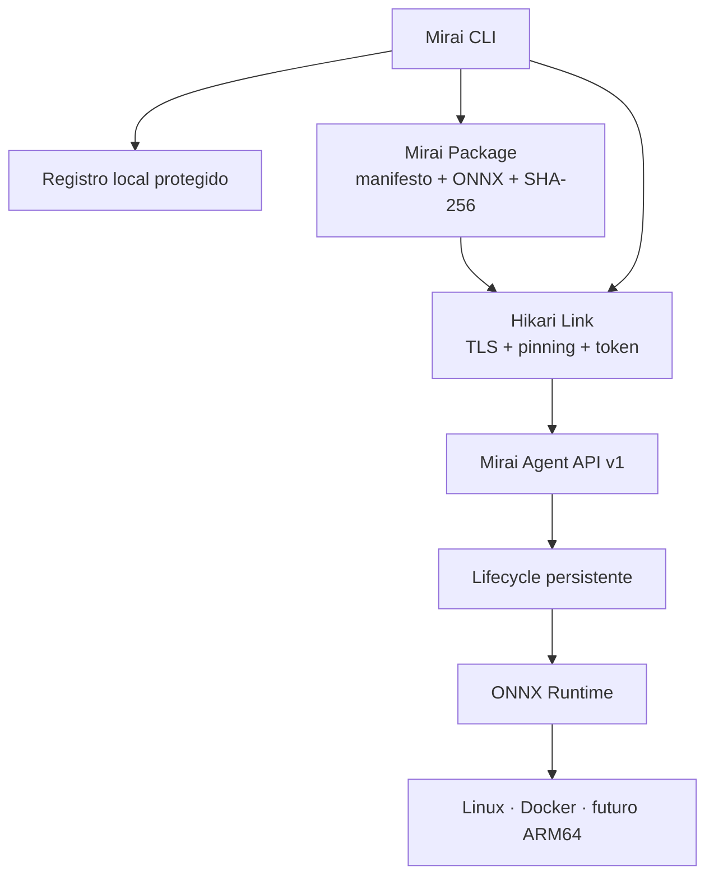

<div align="center">


<br>

[](https://github.com/start6202783-dotcom/MiraiOS/actions/workflows/ci.yml)
[](https://pypi.org/project/miraios/)
[](pyproject.toml)
[](LICENSE)
[](https://onnxruntime.ai/)

**Uma camada operacional local-first para implantar, executar e observar IA
em dispositivos Edge.**

[Começar](#comece-em-3-minutos) ·
[Parear](#conecte-um-dispositivo-na-rede) ·
[Demonstração](#o-fluxo-da-v09) ·
[Arquitetura](#arquitetura) ·
[CLI](#comandos) ·
[Roadmap](#roadmap)

</div>

## O que é o MiraiOS?

O **MiraiOS** é um projeto open-source do **Projeto Hikari** que transforma um
modelo ONNX em um artefato distribuível e um serviço de inferência operável
em Linux:

```text
pack → verificação → pareamento → deploy → ativação → inferência → métricas
```

A CLI permanece no computador do desenvolvedor. O **Mirai Agent** roda no
destino, mantém sua própria identidade, verifica o modelo e executa a
inferência. O primeiro destino pode ser o próprio computador ou um container;
o protocolo é independente de fabricante e não exige uma Raspberry Pi para
começar.

> **Do modelo ao dispositivo físico em um único fluxo verificável.**

## O fluxo da v0.9


A v0.9 adiciona o **Mirai Package**, um artefato `.mirai` reproduzível que
mantém modelo, identidade, contrato e pré-processamento juntos:

| Etapa | O que acontece |
| --- | --- |
| **Pack** | `mirai pack` valida o ONNX e captura seu contrato real. |
| **Bind** | Nome, SemVer e pré-processamento passam a viajar com o modelo. |
| **Verify** | Estrutura, schema, SHA-256 e contrato são conferidos antes do uso. |
| **Operate** | O mesmo pacote pode ser inspecionado, executado e enviado ao Agent. |
| **Preserve** | O Agent guarda o `.mirai` original e o ONNX pronto para execução. |
| **Trust** | O Hikari Link da v0.8 mantém TLS, pinning, autenticação e revogação. |

O fluxo direto com `.onnx` permanece compatível. O formato v1 e seus limites
estão documentados em [Projeto Hikari v0.9](docs/hikari-v0.9.md).

## Por que este projeto existe

- **Local-first:** a inferência acontece onde o dado é produzido.
- **Sem hardware obrigatório:** Linux local e Docker validam o protocolo antes
  da compra de uma placa.
- **Canal verificável:** HTTPS, fingerprint fixado e token por cliente evitam
  confiar silenciosamente no primeiro servidor encontrado.
- **Artefato reproduzível:** modelo, contrato e pré-processamento possuem uma
  identidade única verificável por SHA-256.
- **Lifecycle explícito:** receber um arquivo não significa ativá-lo; cada
  transição é intencional e observável.
- **Formato aberto:** ONNX reduz o acoplamento a um framework de treinamento.
- **Base pequena e auditável:** CLI, cliente, Agent, segurança e runtime são
  módulos Python independentes, sem framework web obrigatório.

## Status atual

| Capacidade | v0.9 |
| --- | --- |
| Validação estrutural com `onnx.checker` | Pronto |
| Pacote `.mirai` determinístico com manifesto estrito | Pronto |
| Verificação de hash e contrato contra o ONNX real | Pronto |
| Pré-processamento declarativo de imagens | Pronto localmente |
| Inferência local numérica, JSON e imagens | Pronto |
| Benchmark com warm-up, mediana, P95 e IPS | Pronto |
| Deploy verificado e lifecycle `ready` / `active` | Pronto |
| Inferência remota, eventos e métricas | Pronto |
| Identidade TLS persistente e fingerprint SHA-256 | Pronto |
| Pareamento de uso único e autenticação por cliente | Pronto |
| Diagnóstico e revogação pela CLI | Pronto |
| Imagens em inferência remota | Ainda não |
| Provider validado no CI | ONNX Runtime CPU |

O projeto está em estágio **alpha**. A v0.9 foi desenhada para laboratório,
localhost e redes privadas controladas; ela ainda não é um gateway para
exposição direta à internet.

## Arquitetura



O Agent usa armazenamento simples e inspecionável:

| Item | Função |
| --- | --- |
| `identity.json` + `agent-*.pem` | Identidade e certificado persistentes. |
| `clients.json` | Clientes pareados; contém somente hashes dos tokens. |
| `packages/` | Pacotes `.mirai` originais identificados pelo hash. |
| `models/` | Modelos ONNX validados e identificados pelo hash. |
| `deployments.json` | Deployments, estados e seleção ativa. |
| `events.jsonl` | Histórico de pareamentos, deploys, ativações e inferências. |

O formato está especificado em [Projeto Hikari v0.9](docs/hikari-v0.9.md) e o
modelo de confiança da rede em [Projeto Hikari v0.8](docs/hikari-v0.8.md).

## Comece em 3 minutos

### 1. Instale a versão do repositório

O MiraiOS requer Python 3.10 ou superior:

```bash
git clone https://github.com/start6202783-dotcom/MiraiOS.git
cd MiraiOS
python -m venv .venv
```

Ative o ambiente no Linux ou macOS:

```bash
source .venv/bin/activate
python -m pip install --editable ".[dev]"
```

No Windows PowerShell:

```powershell
.venv\Scripts\Activate.ps1
python -m pip install --editable ".[dev]"
```

Também é possível instalar a versão publicada:

```bash
python -m pip install --upgrade miraios
```

### 2. Inicie um Agent local

No primeiro terminal:

```bash
mirai agent start
```

O endereço padrão é `http://127.0.0.1:8080`. Esse modo deliberadamente
dispensa pareamento porque só aceita conexões da própria máquina.

### 3. Empacote, faça deploy, ative e execute

No segundo terminal:

```bash
python scripts/create_dummy_model.py
mirai pack examples/dummy_model.onnx \
  --name dummy \
  --package-version 1.0.0
mirai device add local --url http://127.0.0.1:8080
mirai doctor --device local
mirai validate dummy-1.0.0.mirai
mirai deploy dummy-1.0.0.mirai --device local
mirai status --device local
mirai activate ID-EXIBIDO-NO-DEPLOY --device local
mirai run --device local --input 5.0
mirai logs --device local
```

O modelo de exemplo soma `1` à entrada, portanto o resultado esperado é
`6.0`. Substitua `ID-EXIBIDO-NO-DEPLOY` pelo identificador retornado.

## Conecte um dispositivo na rede

No dispositivo de destino, inicie o Agent em um endereço de rede:

```bash
mirai agent start --host 0.0.0.0
```

Fora de localhost, o Agent ativa HTTPS e autenticação automaticamente. Ele
exibe um **código de uso único** e um **fingerprint SHA-256**. Confira esses
dois valores diretamente no terminal do dispositivo e, no computador com a
CLI, execute:

```bash
mirai device pair edge \
  --url https://192.168.1.40:8080 \
  --code CODIGO-EXIBIDO \
  --fingerprint SHA256-EXIBIDO

mirai doctor --device edge
```

Substitua o IP e os valores pelos exibidos pelo Agent. O fingerprint é
verificado antes que o código seja transmitido. Depois do pareamento, os
comandos existentes usam o canal autenticado sem receber segredos na linha de
comando.

Para encerrar o acesso dessa CLI:

```bash
mirai device revoke edge
```

## Comandos

| Comando | Descrição |
| --- | --- |
| `mirai pack modelo.onnx --name app --package-version 1.0.0` | Cria `app-1.0.0.mirai`. |
| `mirai validate ARQUIVO` | Valida integralmente um ONNX ou `.mirai`. |
| `mirai info ARQUIVO` | Exibe contrato, hashes, tipos, shapes e nós. |
| `mirai run ARQUIVO --input 5` | Executa inferência local. |
| `mirai benchmark ARQUIVO` | Mede latência, P95 e vazão local. |
| `mirai agent start` | Inicia o Agent local. |
| `mirai agent start --host 0.0.0.0` | Inicia um Agent HTTPS pareável. |
| `mirai device add/list/info/remove` | Gerencia destinos locais. |
| `mirai device pair edge ...` | Verifica e pareia um Agent HTTPS. |
| `mirai device revoke edge` | Revoga o token e remove o cadastro. |
| `mirai doctor --device edge` | Diagnostica canal, versões e runtime. |
| `mirai deploy ARQUIVO --device edge` | Envia um ONNX ou `.mirai`. |
| `mirai status --device edge` | Lista deployments e o modelo ativo. |
| `mirai activate ID --device edge` | Ativa um deployment pronto. |
| `mirai run --device edge --input 5` | Executa no deployment ativo. |
| `mirai logs --device edge` | Consulta eventos recentes. |

Execute `mirai COMANDO --help` para ver todas as opções.

## Entradas e inferência

### Local

Escalares e arrays JSON são convertidos para o dtype e o shape esperados:

```bash
mirai run modelo.onnx --input 5.0
mirai run modelo.onnx --input "[[1, 2, 3]]"
```

Modelos com múltiplas entradas aceitam nome ou ordem:

```bash
mirai run soma.onnx --input x=5 --input y=7
mirai run soma.onnx --input 5 --input 7
```

Imagens NCHW e NHWC são suportadas localmente:

```bash
mirai run visao.onnx --input foto.jpg --layout auto
```

Um pacote pode fixar layout e normalização para impedir que esses parâmetros
se percam entre máquinas:

```bash
mirai pack visao.onnx \
  --name visao \
  --package-version 1.0.0 \
  --image-input images \
  --layout nchw \
  --scale 0.00392156862745098 \
  --mean "[0.485, 0.456, 0.406]" \
  --std "[0.229, 0.224, 0.225]"

mirai run visao-1.0.0.mirai --input foto.jpg
```

O formato v1 usa resize `stretch`, canais `L`/`RGB`/`RGBA` e a transformação
`(pixel × scale - mean) / std`. Letterbox, BGR, tokenização e arquivos
auxiliares ainda não fazem parte do contrato.

### No Agent

A inferência remota aceita escalares, arrays JSON e entradas nomeadas:

```bash
mirai run --device edge --input 5
mirai run --device edge --input x=5 --input y=7
```

Caminhos de imagens continuam rejeitados no Agent porque a API remota não
transfere arquivos de entrada. O contrato de imagem já é preservado no
deployment para uma futura API binária segura.

## Benchmark local

```bash
mirai benchmark modelo-1.0.0.mirai --runs 100 --warmup 5
```

O carregamento do modelo não entra na medição. O relatório inclui tempo total,
latência média, mediana, percentil 95 e inferências por segundo.

## Docker: dispositivo sem placa física

O repositório inclui um Agent HTTPS isolado em container:

```bash
docker compose up --build -d
docker compose logs mirai-agent
```

Copie dos logs o código e o fingerprint e faça o pareamento:

```bash
mirai device pair docker \
  --url https://127.0.0.1:8080 \
  --code CODIGO-EXIBIDO \
  --fingerprint SHA256-EXIBIDO
mirai doctor --device docker
```

O volume `mirai-agent-data` preserva identidade, clientes, pacotes, modelos,
lifecycle e eventos. Para encerrar:

```bash
docker compose down
```

## Segurança

O Hikari Link estabelece uma fronteira clara entre desenvolvimento local e
acesso pela rede:

- HTTP sem autenticação é aceito somente em endereços de loopback;
- qualquer escuta fora de loopback ativa HTTPS automaticamente;
- o Agent gera certificado e chave RSA persistentes e exige TLS 1.2 ou mais;
- a CLI fixa o fingerprint SHA-256 antes de enviar qualquer segredo;
- o código de pareamento tem 12 caracteres, expira em dez minutos, fica apenas
  em memória e só pode ser usado uma vez;
- cada cliente recebe um token aleatório próprio e revogável;
- o Agent persiste somente o SHA-256 do token; o registro da CLI usa permissão
  `0600` em sistemas compatíveis;
- somente `/v1/health` e `/v1/pair` são públicos no modo seguro;
- respostas da API usam `Cache-Control: no-store`.
- pacotes recusam arquivos extras, duplicados, links, compressão e manifesto
  fora do schema;
- o hash interno protege o ONNX e o contrato declarado é comparado ao runtime.

Ainda não há papéis de autorização, rotação automática de certificados,
limitação de tentativas, assinatura digital de pacotes ou integração com uma
autoridade certificadora. Hash comprova integridade, não autoria. Use firewall,
mantenha a porta em uma rede privada e não exponha o Agent diretamente à
internet.

## Roadmap

### Entregue

- [x] **v0.5.1 — Runtime:** validação real, inferência, imagens, benchmark,
  testes e CI.
- [x] **v0.6 — Deploy:** Agent, registro de dispositivos, upload verificado,
  logs e Docker.
- [x] **v0.7 — Operação:** lifecycle persistente, ativação, inferência remota
  e métricas.
- [x] **v0.8 — Confiança:** identidade TLS, pinning, pareamento, autenticação,
  diagnóstico e revogação.
- [x] **v0.9 — Distribuição:** pacote `.mirai` reproduzível, manifesto estrito,
  contrato verificável, pré-processamento e deploy compatível.

### Próximo

- [ ] Health check por modelo, rollback e histórico de ativações.
- [ ] Saída JSON para automação e relatórios de benchmark.
- [ ] Rotação de identidade, limitação de pareamento e papéis de acesso.
- [ ] Assinatura e política de confiança para pacotes `.mirai`.

### Depois

- [ ] Descoberta de dispositivos e visão de frota.
- [ ] Seleção explícita de providers e perfis de hardware.
- [ ] Compatibilidade validada em ARM64.
- [ ] Providers CUDA e DirectML.
- [ ] Suporte experimental a outros runtimes e RISC-V.

O roadmap prioriza um protocolo seguro e útil antes de ampliar a quantidade de
hardwares suportados.

## Desenvolvimento

Instale as dependências de desenvolvimento e execute a suíte:

```bash
python -m pip install --editable ".[dev]"
python -m compileall -q src tests scripts
python -m pytest
```

O CI executa os testes em Python 3.10, 3.11, 3.12 e 3.13. Consulte
[CONTRIBUTING.md](CONTRIBUTING.md) antes de enviar mudanças.

Os ativos visuais do README são reproduzíveis:

```bash
python scripts/render_readme_assets.py
```

## Projeto Hikari

**Hikari** é a primeira fase do MiraiOS: construir uma camada pequena,
portátil e verificável entre modelos de IA e hardware local. O nome Mirai
significa “futuro”; Hikari, “luz”.

Documentação dos marcos:

- [v0.6 — Mirai Agent](docs/hikari-v0.6.md)
- [v0.7 — lifecycle e inferência remota](docs/hikari-v0.7.md)
- [v0.8 — Hikari Link](docs/hikari-v0.8.md)
- [v0.9 — Mirai Package](docs/hikari-v0.9.md)
- [Changelog completo](CHANGELOG.md)

## Licença

Distribuído sob a [licença MIT](LICENSE).

<div align="center">


**The Future Runs Local**

</div>
