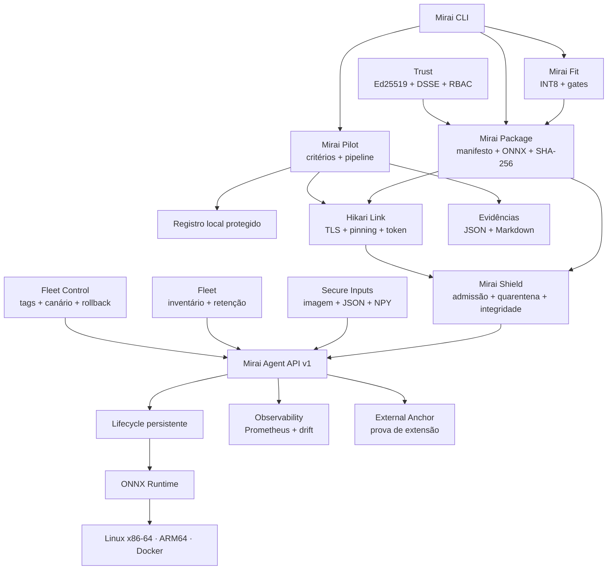

<div align="center">


<br>

[](https://github.com/start6202783-dotcom/MiraiOS/actions/workflows/ci.yml)
[](https://pypi.org/project/miraios/)
[](pyproject.toml)
[](LICENSE)
[](https://onnxruntime.ai/)

**Uma camada operacional local-first para implantar, executar e observar IA
em dispositivos Edge.**

[Começar](#comece-em-3-minutos) ·
[Mirai Pilot](#mirai-pilot) ·
[Parear](#conecte-um-dispositivo-na-rede) ·
[v0.13](#o-marco-da-v013) ·
[Arquitetura](#arquitetura) ·
[CLI](#comandos) ·
[Roadmap](#roadmap)

</div>

## O que é o MiraiOS?

O **MiraiOS** é um projeto open-source do **Projeto Hikari** que transforma um
modelo ONNX em um artefato distribuível e um serviço de inferência operável
em Linux:

```text
assinar → verificar → deploy → medir → aceitar → evidência assinada
```

A CLI permanece no computador do desenvolvedor. O **Mirai Agent** roda no
destino, mantém sua própria identidade, verifica o modelo e executa a
inferência. O primeiro destino pode ser o próprio computador ou um container;
o protocolo é independente de fabricante e não exige uma Raspberry Pi para
começar.

> **Do modelo ao dispositivo físico em um único fluxo verificável, com
> critérios e rollback.**

## O marco da v0.13

A v0.13 conecta as garantias das versões anteriores em um ciclo operacional:

```text
gerar variante → aprovar → planejar → canário → observar → ancorar
```

| Pilar | Entrega |
| --- | --- |
| **Fleet Control** | Tags, seletores, canário, lotes, gate cumulativo e rollback global. |
| **External Audit** | Checkpoint fora do Agent e prova criptográfica de extensão da cadeia conhecida. |
| **Observability** | JSON, Prometheus, erro, P95 e sinais heurísticos de drift sem persistir entradas ou saídas brutas. |
| **Mirai Fit v1** | Dynamic INT8, comparação numérica, benchmark, gates, staging transacional e assinatura opcional. |

O rollout é uma simulação por padrão e exige `--apply` para alterar Agents. O
Fit publica um pacote novo somente quando os gates passam; ele nunca otimiza
silenciosamente dentro do dispositivo. Veja os contratos e limites em
[Projeto Hikari v0.13](docs/hikari-v0.13.md).

## A base de segurança da v0.12


A v0.12 introduz o **Mirai Shield**, uma fronteira de admissão e integridade
entre um artefato recebido e o runtime. O objetivo não é declarar que um
modelo desconhecido é seguro; é eliminar ambiguidades, limitar trabalho,
registrar decisões e impedir que um pacote não autorizado chegue
silenciosamente à inferência.

| Etapa | O que acontece |
| --- | --- |
| **Admita** | O modo `signed` aceita somente `.mirai` com DSSE/Ed25519 válido por uma chave confiável. |
| **Coloque em quarentena** | ONNX é carregado sem dados externos e recebe limites de grafo, rank, tensores e inicializadores antes do runtime. |
| **Fixe a identidade** | Pacote e modelo são instalados por conteúdo, somente leitura, e verificados novamente antes de ativar ou inferir. |
| **Registre** | Cada evento entra em uma cadeia SHA-256 com sequência, hash anterior e checkpoint durável. |
| **Limite** | Timeout, fila, concorrência de requisições e operações pesadas reduzem abuso de recursos. |
| **Teste** | 1.371 testes, incluindo um corpus determinístico com 1.024 casos hostis e 132 cenários próprios da v0.13. |

O desenho e as decisões estão em [Projeto Hikari v0.12](docs/hikari-v0.12.md),
o modelo de ameaças em [docs/threat-model.md](docs/threat-model.md) e a
pesquisa que orientou a implementação em
[Mirai Shield: referências e decisões](docs/research/0001-mirai-shield.md).

## Por que este projeto existe

- **Local-first:** a inferência acontece onde o dado é produzido.
- **Sem hardware obrigatório:** Linux local e Docker validam o protocolo antes
  da compra de uma placa.
- **Canal verificável:** HTTPS, fingerprint fixado e token por cliente evitam
  confiar silenciosamente no primeiro servidor encontrado.
- **Artefato reproduzível:** modelo, contrato e pré-processamento possuem uma
  identidade única verificável por SHA-256.
- **Lifecycle explícito:** receber um arquivo não significa ativá-lo; cada
  transição é intencional e observável.
- **Aceite reproduzível:** resultado, P95 e vazão podem virar critérios
  executáveis, não apenas promessas.
- **Falha recuperável:** um piloto reprovado não substitui silenciosamente o
  deployment que já funcionava.
- **Evidência portátil:** relatórios JSON e Markdown podem acompanhar a entrega
  técnica de um piloto.
- **Formato aberto:** ONNX reduz o acoplamento a um framework de treinamento.
- **Base pequena e auditável:** CLI, cliente, Agent, segurança e runtime são
  módulos Python independentes, sem framework web obrigatório.

## Status atual

| Capacidade | v0.13 |
| --- | --- |
| Validação estrutural com `onnx.checker` | Pronto |
| Pacote `.mirai` determinístico com manifesto estrito | Pronto |
| Verificação de hash e contrato contra o ONNX real | Pronto |
| Pré-processamento declarativo de imagens | Pronto localmente |
| Inferência local numérica, JSON e imagens | Pronto |
| Benchmark com warm-up, mediana, P95 e IPS | Pronto |
| Deploy verificado e lifecycle `ready` / `active` | Pronto |
| Inferência remota, eventos e métricas | Pronto |
| Identidade TLS persistente e fingerprint SHA-256 | Pronto |
| Pareamento de uso único e autenticação por cliente | Pronto |
| Diagnóstico e revogação pela CLI | Pronto |
| Launch completo em um comando | Pronto |
| Piloto declarativo com critérios de aceite | Pronto |
| Benchmark remoto e relatórios JSON/Markdown | Pronto |
| Rollback automático após reprovação | Pronto |
| Assinatura Ed25519/DSSE destacada | Pronto |
| Admissão obrigatória por assinatura e trust store local | Pronto; opt-in com `--admission signed` |
| Quarentena estrutural ONNX e rejeição de dados externos | Pronto |
| JSON estrito com limites e nomes únicos | Pronto |
| Instalação atômica, content-addressed e revalidação em uso | Pronto |
| Auditoria encadeada com checkpoint e endpoint de verificação | Pronto |
| Limites de fila, sockets, requisições e trabalho pesado | Pronto |
| Histórico e retenção segura | Pronto |
| RBAC, rate limit e rotação de identidade | Pronto |
| PNG/JPEG/BMP/WebP/JSON/NPY em inferência remota | Pronto |
| Visão de frota e descoberta mDNS opcional | Pronto; mDNS não autentica |
| Tags e seletores determinísticos de frota | Pronto |
| Rollout em canário/lotes com gate e rollback | Pronto; simulação por padrão |
| Ancoragem externa local e prova de extensão | Pronto; não é transparência pública |
| Métricas JSON/Prometheus e sinais de drift | Pronto; drift é heurístico |
| Mirai Fit Dynamic INT8 com gates | Pronto; benchmark no control plane |
| Perfis CPU/CUDA/DirectML | Seleção pronta; CPU validado |
| ARM64 Linux / ONNX Runtime CPU | Job nativo no CI |
| Plugins de runtime e RISC-V | Experimental, não validado |

O projeto está em estágio **alpha**. A v0.13 foi desenhada para laboratório,
localhost e redes privadas controladas; ela ainda não é um gateway para
exposição direta à internet.

## Arquitetura



O Agent usa armazenamento simples e inspecionável:

| Item | Função |
| --- | --- |
| `identity.json` + `agent-*.pem` | Identidade e certificado persistentes. |
| `clients.json` | Clientes pareados; contém somente hashes dos tokens. |
| `packages/` | Pacotes `.mirai` originais identificados pelo hash. |
| `models/` | Modelos ONNX validados e identificados pelo hash. |
| `deployments.json` | Deployments, estados e seleção ativa. |
| `audit.jsonl` + `audit.jsonl.head` | Cadeia verificável de eventos e checkpoint do head. |
| `observability.json` | Contadores e amostras numéricas limitadas, sem entradas ou saídas brutas. |
| `events.jsonl` | Histórico legado, preservado durante a migração. |

Controle, observabilidade, ancoragem e Fit estão especificados em
[Projeto Hikari v0.13](docs/hikari-v0.13.md), admissão e integridade em
[Projeto Hikari v0.12](docs/hikari-v0.12.md), confiança, anexos e frota em
[Projeto Hikari v0.11](docs/hikari-v0.11.md), o piloto em
[Projeto Hikari v0.10](docs/hikari-v0.10.md), o
formato em [Projeto Hikari v0.9](docs/hikari-v0.9.md) e o
modelo de confiança da rede em [Projeto Hikari v0.8](docs/hikari-v0.8.md).

## Comece em 3 minutos

### 1. Instale a versão do repositório

O MiraiOS requer Python 3.10 ou superior:

```bash
git clone https://github.com/start6202783-dotcom/MiraiOS.git
cd MiraiOS
python -m venv .venv
```

Ative o ambiente no Linux ou macOS:

```bash
source .venv/bin/activate
python -m pip install --editable ".[dev]"
```

No Windows PowerShell:

```powershell
.venv\Scripts\Activate.ps1
python -m pip install --editable ".[dev]"
```

Também é possível instalar a versão publicada:

```bash
python -m pip install --upgrade miraios
```

### 2. Inicie um Agent local

No primeiro terminal:

```bash
mirai agent start
```

O endereço padrão é `http://127.0.0.1:8080`. Esse modo deliberadamente
dispensa pareamento porque só aceita conexões da própria máquina.

### 3. Empacote e faça o primeiro launch

No segundo terminal:

```bash
python scripts/create_dummy_model.py
mirai pack examples/dummy_model.onnx \
  --name dummy \
  --package-version 1.0.0
mirai device add local --url http://127.0.0.1:8080
mirai launch dummy-1.0.0.mirai --device local --input 5.0
```

O modelo de exemplo soma `1` à entrada, portanto o resultado esperado é
`6.0`. O `launch` valida o pacote e o dispositivo, faz deploy, ativa e testa o
modelo. Se o teste final falhar, ele restaura a ativação anterior.

### Exija artefatos assinados

Crie uma chave de release na máquina do operador, assine o pacote e configure
no Agent somente a chave pública:

```bash
mirai key generate release
mirai sign dummy-1.0.0.mirai --key ~/.mirai/keys/release.key

mirai agent start \
  --admission signed \
  --trust-key ~/.mirai/keys/release.pub
```

No outro terminal, envie o pacote e o envelope destacado:

```bash
mirai deploy dummy-1.0.0.mirai \
  --device local \
  --signature dummy-1.0.0.mirai.sig
```

Nesse modo, ONNX avulso, assinatura ausente, chave desconhecida, digest
alterado e nome de artefato divergente são recusados antes da instalação.
Distribua a chave pública por um canal já confiável e mantenha a chave privada
fora do dispositivo Edge.

## Mirai Pilot

Quando você precisa provar que uma entrega funciona e atende a uma meta, crie
um projeto de piloto:

```bash
mirai pilot init
```

O arquivo `mirai-pilot.json` já nasce com o exemplo local. Depois de revisar os
valores, execute:

```bash
mirai pilot run
```

O Pilot executa validação, diagnóstico, deploy, ativação, health check,
benchmark remoto e critérios de aceite. No fim, ele grava:

```text
.mirai/reports/
├── dummy-local-DATA-ID.json  # evidência estruturada para automação
├── dummy-local-DATA-ID.json.sig # assinatura DSSE opcional
└── dummy-local-DATA-ID.md    # relatório legível para a entrega
```

Se qualquer etapa ou critério falhar, o relatório registra o motivo e o
deployment anterior é restaurado. Veja todos os campos, limites e garantias em
[Projeto Hikari v0.10](docs/hikari-v0.10.md).

Consulte ou aplique retenção sem scripts próprios:

```bash
mirai pilot history --limit 20
mirai pilot prune --keep 20        # simulação
mirai pilot prune --keep 20 --apply
```

Para assinatura automática, informe `report.signing_key` no projeto. A chave
privada permanece apenas na máquina que executa o Pilot.

## Operação de frota na v0.13

Organize dispositivos com tags não secretas e selecione grupos sem manter
listas manuais:

```bash
mirai device tag edge-01 --set env=prod --set region=br
mirai device tag edge-02 --set env=prod --set region=br
mirai fleet status --selector env=prod,region=br
```

Planeje uma entrega progressiva. Sem `--apply`, nenhum Agent é alterado:

```bash
mirai fleet rollout app-2.0.0.mirai \
  --selector env=prod,region=br \
  --canary 10 \
  --batch-size 5 \
  --max-failure-rate 0
```

Depois de revisar a evidência em `.mirai/rollouts/`, execute conscientemente:

```bash
mirai fleet rollout app-2.0.0.mirai \
  --selector env=prod,region=br \
  --canary 10 \
  --batch-size 5 \
  --max-failure-rate 0 \
  --apply
```

Observe e ancore a mesma seleção:

```bash
mirai fleet observe --selector env=prod,region=br
mirai fleet anchor --selector env=prod,region=br
```

Para gerar uma candidata INT8 antes do rollout:

```bash
mirai fit modelo.onnx \
  --name app-int8 \
  --package-version 1.0.0 \
  --output app-int8-1.0.0.mirai \
  --max-absolute-error 0.05 \
  --min-speedup 1.0
```

O Fit grava `.fit.json` mesmo quando rejeita a candidata, mas só publica o
`.mirai` quando qualidade e desempenho passam. O benchmark acontece no host
do control plane; valide novamente no hardware de destino. Detalhes completos
em [Projeto Hikari v0.13](docs/hikari-v0.13.md).

## Conecte um dispositivo na rede

No dispositivo de destino, inicie o Agent em um endereço de rede:

```bash
mirai agent start --host 0.0.0.0 --pairing-role operator
```

Fora de localhost, o Agent ativa HTTPS e autenticação automaticamente. Ele
exibe um **código de uso único** e um **fingerprint SHA-256**. Confira esses
dois valores diretamente no terminal do dispositivo e, no computador com a
CLI, execute:

```bash
mirai device pair edge \
  --url https://192.168.1.40:8080 \
  --code CODIGO-EXIBIDO \
  --fingerprint SHA256-EXIBIDO

mirai doctor --device edge
```

Substitua o IP e os valores pelos exibidos pelo Agent. O fingerprint é
verificado antes que o código seja transmitido. Depois do pareamento, os
comandos existentes usam o canal autenticado sem receber segredos na linha de
comando.

Para encerrar o acesso dessa CLI:

```bash
mirai device revoke edge
```

O papel é escolhido por código emitido: `viewer` consulta, `operator` opera
modelos e `admin` também gerencia clientes. Para descoberta link-local
opcional, instale `miraios[discovery]`, inicie com `--discoverable` e use
`mirai device discover`; o candidato encontrado ainda precisa do mesmo
pareamento com fingerprint.

## Comandos

| Comando | Descrição |
| --- | --- |
| `mirai pack modelo.onnx --name app --package-version 1.0.0` | Cria `app-1.0.0.mirai`. |
| `mirai validate ARQUIVO` | Valida integralmente um ONNX ou `.mirai`. |
| `mirai info ARQUIVO` | Exibe contrato, hashes, tipos, shapes e nós. |
| `mirai run ARQUIVO --input 5` | Executa inferência local. |
| `mirai benchmark ARQUIVO` | Mede latência, P95 e vazão local. |
| `mirai fit MODELO --name app-int8 --package-version 1.0.0 --output app.mirai` | Gera, testa e aprova uma variante Dynamic INT8. |
| `mirai launch ARQUIVO --device edge --input 5` | Faz o fluxo rápido até a inferência. |
| `mirai pilot init` | Cria um projeto declarativo de piloto. |
| `mirai pilot run [ARQUIVO]` | Executa critérios, relatório e rollback. |
| `mirai pilot history/prune` | Consulta evidências e aplica retenção confirmada. |
| `mirai key generate release` | Cria um par Ed25519 local. |
| `mirai sign/verify ARQUIVO ...` | Assina ou verifica pacote/relatório com DSSE. |
| `mirai agent start` | Inicia o Agent local. |
| `mirai agent start --host 0.0.0.0` | Inicia um Agent HTTPS pareável. |
| `mirai agent start --admission signed --trust-key release.pub` | Exige pacote assinado por chave confiável. |
| `mirai device add/list/info/remove` | Gerencia destinos locais. |
| `mirai device pair edge ...` | Verifica e pareia um Agent HTTPS. |
| `mirai device revoke edge` | Revoga o token e remove o cadastro. |
| `mirai device clients/role edge ...` | Administra papéis dos clientes pareados. |
| `mirai device tag edge --set env=prod` | Define/remove tags não secretas de seleção. |
| `mirai device discover` | Encontra candidatos mDNS sem confiar neles. |
| `mirai doctor --device edge` | Diagnostica canal, versões e runtime. |
| `mirai deploy ARQUIVO --device edge --signature ARQUIVO.sig` | Envia artefato e assinatura destacada. |
| `mirai cleanup --device edge --keep 5` | Simula/aplica retenção de deployments. |
| `mirai fleet status --selector env=prod` | Consulta uma seleção, preservando hosts offline. |
| `mirai fleet rollout ARQUIVO ...` | Planeja canário/lotes; `--apply` executa com gate e rollback. |
| `mirai fleet observe` | Coleta métricas e sinais heurísticos de drift. |
| `mirai fleet anchor` | Ancora heads no ledger externo local. |
| `mirai audit anchor --device edge` | Ancora e verifica a extensão de um Agent. |
| `mirai runtime list` | Lista ONNX e plugins experimentais descobertos. |
| `mirai status --device edge` | Lista deployments e o modelo ativo. |
| `mirai activate ID --device edge` | Ativa um deployment pronto. |
| `mirai run --device edge --input 5` | Executa no deployment ativo. |
| `mirai logs --device edge` | Consulta eventos recentes. |

Execute `mirai COMANDO --help` para ver todas as opções.

## Entradas e inferência

### Local

Escalares e arrays JSON são convertidos para o dtype e o shape esperados:

```bash
mirai run modelo.onnx --input 5.0
mirai run modelo.onnx --input "[[1, 2, 3]]"
```

Modelos com múltiplas entradas aceitam nome ou ordem:

```bash
mirai run soma.onnx --input x=5 --input y=7
mirai run soma.onnx --input 5 --input 7
```

Imagens NCHW e NHWC são suportadas localmente:

```bash
mirai run visao.onnx --input foto.jpg --layout auto
```

Um pacote pode fixar layout e normalização para impedir que esses parâmetros
se percam entre máquinas:

```bash
mirai pack visao.onnx \
  --name visao \
  --package-version 1.0.0 \
  --image-input images \
  --layout nchw \
  --scale 0.00392156862745098 \
  --mean "[0.485, 0.456, 0.406]" \
  --std "[0.229, 0.224, 0.225]"

mirai run visao-1.0.0.mirai --input foto.jpg
```

O formato v1 usa resize `stretch`, canais `L`/`RGB`/`RGBA` e a transformação
`(pixel × scale - mean) / std`. Letterbox, BGR, tokenização e arquivos
auxiliares ainda não fazem parte do contrato.

### No Agent

A inferência remota aceita escalares, arrays, entradas nomeadas e arquivos:

```bash
mirai run --device edge --input 5
mirai run --device edge --input x=5 --input y=7
mirai run --device edge --input image=foto.png --layout nchw
mirai run --device edge --input tensor.npy
mirai run --device edge --input dados.json
```

PNG, JPEG, BMP, WebP, JSON e NPY são enviados com tamanho e SHA-256, validados
contra extensão, tipo e conteúdo real, materializados com nome gerado e
eliminados depois da inferência. O limite é 8 MB por arquivo e 10 MB por
requisição; NPY recusa pickle e objetos Python.

## Benchmark local

```bash
mirai benchmark modelo-1.0.0.mirai --runs 100 --warmup 5
```

O carregamento do modelo não entra na medição. O relatório inclui tempo total,
latência média, mediana, percentil 95 e inferências por segundo.

No Mirai Pilot, as medições acontecem no Agent e podem ser comparadas a
`max_p95_ms` e `min_ips`. O tempo de rede não entra na latência do modelo.

## Docker: dispositivo sem placa física

O repositório inclui um Agent HTTPS isolado em container:

```bash
docker compose up --build -d
docker compose logs mirai-agent
```

Copie dos logs o código e o fingerprint e faça o pareamento:

```bash
mirai device pair docker \
  --url https://127.0.0.1:8080 \
  --code CODIGO-EXIBIDO \
  --fingerprint SHA256-EXIBIDO
mirai doctor --device docker
```

O volume `mirai-agent-data` preserva identidade, clientes, pacotes, modelos,
lifecycle e eventos. Para encerrar:

```bash
docker compose down
```

## Segurança

O Hikari Link estabelece uma fronteira clara entre desenvolvimento local e
acesso pela rede:

- HTTP sem autenticação é aceito somente em endereços de loopback;
- qualquer escuta fora de loopback ativa HTTPS automaticamente;
- o Agent gera certificado e chave RSA persistentes e exige TLS 1.2 ou mais;
- a CLI fixa o fingerprint SHA-256 antes de enviar qualquer segredo;
- o código de pareamento tem 12 caracteres, expira em dez minutos, fica apenas
  em memória e só pode ser usado uma vez;
- cada cliente recebe um token aleatório próprio e revogável;
- cada cliente recebe `viewer`, `operator` ou `admin`, e toda operação exige o
  papel mínimo correspondente;
- cinco falhas recentes de pareamento por origem acionam bloqueio temporário;
- o Agent persiste somente o SHA-256 do token; o registro da CLI usa permissão
  `0600` em sistemas compatíveis;
- somente `/v1/health` e `/v1/pair` são públicos no modo seguro;
- respostas da API usam `Cache-Control: no-store`;
- pacotes recusam arquivos extras, duplicados, links, compressão e manifesto
  fora do schema;
- a política `signed` liga nome, tamanho e SHA-256 do `.mirai` a um envelope
  DSSE/Ed25519 e recusa assinatura não solicitada inválida;
- ONNX é aberto com `load_external_data=False`; qualquer tensor com dados
  externos, grafo profundo, rank extremo ou orçamento estrutural excedido é
  recusado antes de criar uma sessão;
- JSON de rede, assinatura, registro e auditoria recusa UTF-8 inválido,
  chaves duplicadas, `NaN`, `Infinity`, profundidade e volume excessivos;
- arquivos de estado usam troca atômica, `fsync`, temporários exclusivos e
  verificação contra alteração durante a leitura;
- pacote e modelo instalados são identificados pelo conteúdo, marcados como
  somente leitura e revalidados antes de ativação e inferência;
- o log de auditoria encadeia cada evento ao anterior e mantém um checkpoint
  durável para detectar edição, reordenação, divergência e truncamento;
- o control plane pode ancorar esse checkpoint fora do Agent e exige uma prova
  contínua de extensão antes de aceitar um head novo;
- rollout é somente plano por padrão, usa gates cumulativos e registra qualquer
  falha ao restaurar ativações anteriores;
- observabilidade persiste apenas contadores, latência e resumo numérico
  limitado; entradas e resultados brutos não entram no arquivo de métricas;
- variantes INT8 são criadas em staging, comparadas e publicadas
  transacionalmente somente depois dos gates;
- o servidor limita sockets lentos, fila, requisições simultâneas e trabalhos
  pesados, retornando erro em vez de criar trabalho ilimitado;
- o hash interno protege o ONNX e o contrato declarado é comparado ao runtime;
- Ed25519 e DSSE assinam digests tipados de pacotes e relatórios;
- uploads remotos têm allowlist, hash, limites, validação de conteúdo e vida
  somente temporária;
- a identidade pode ser rotacionada offline, invalidando clientes e sem
  arquivar a chave privada antiga;
- um Pilot reprovado restaura a ativação anterior ou desativa o primeiro
  candidato;
- relatórios não recebem token, código de pareamento ou chave privada e, por
  padrão, ocultam as entradas de inferência.

### Limites honestos da fronteira

- O Agent usa `http.server`, que a documentação do Python não recomenda para
  produção. Use somente localhost ou rede privada com firewall.
- A quarentena estrutural reduz risco, mas não é sandbox de processo, cgroup,
  seccomp, antivírus nem prova de que um ONNX desconhecido é benigno.
- A âncora padrão detecta divergência entre Agent e control plane. Ela continua
  local: um invasor que controle administrativamente os dois sistemas pode
  reescrever ambos; esse cenário exige transparência ou custódia independente.
- Drift compara janelas de médias. Ele não mede acurácia nem comprova mudança
  conceitual nos dados.
- O Fit v1 mede a candidata no control plane. Aprovação não substitui um
  conjunto representativo nem benchmark no hardware de destino.
- DSSE prova posse da chave configurada, não a identidade humana por trás
  dela. Distribuição, revogação e guarda das chaves continuam sendo tarefas do
  operador.
- Ainda não há mTLS, autoridade certificadora, transparência pública,
  isolamento por processo ou cofre de chaves.

Leia o [modelo de ameaças completo](docs/threat-model.md). Não exponha o Agent
diretamente à internet.

## Roadmap

### Entregue

- [x] **v0.5.1 — Runtime:** validação real, inferência, imagens, benchmark,
  testes e CI.
- [x] **v0.6 — Deploy:** Agent, registro de dispositivos, upload verificado,
  logs e Docker.
- [x] **v0.7 — Operação:** lifecycle persistente, ativação, inferência remota
  e métricas.
- [x] **v0.8 — Confiança:** identidade TLS, pinning, pareamento, autenticação,
  diagnóstico e revogação.
- [x] **v0.9 — Distribuição:** pacote `.mirai` reproduzível, manifesto estrito,
  contrato verificável, pré-processamento e deploy compatível.
- [x] **v0.10 — Aceite:** launch unificado, projeto declarativo, health check,
  benchmark remoto, critérios, evidências e rollback automático.
- [x] **v0.11 — Confiança e frota:** Ed25519/DSSE, RBAC, rotação, rate limit,
  anexos seguros, retenção, frota, providers explícitos e CI ARM64.
- [x] **v0.12 — Mirai Shield:** admissão assinada, quarentena ONNX, JSON
  estrito, instalação atômica, revalidação em uso, auditoria encadeada,
  limites de recursos e gates de qualidade.
- [x] **v0.13 — Operação verificável:** tags e seletores, rollout progressivo,
  ancoragem externa local, Prometheus/drift e Mirai Fit Dynamic INT8.

### Próximo

- [ ] mTLS e rotação automatizada, com recuperação documentada.
- [ ] Serviço de transparência independente para âncoras e política distribuída
  de revogação de chaves.
- [ ] Isolamento do runtime em processo dedicado com limites do sistema
  operacional e reinício supervisionado.
- [ ] Dashboard web local sobre a API de frota.
- [ ] Testes físicos publicados para NVIDIA CUDA e Windows DirectML/WinML.
- [ ] Assinatura e distribuição de plugins de runtime.
- [ ] Compatibilidade RISC-V somente após runner e runtime reais.

O roadmap prioriza um protocolo seguro e útil antes de ampliar a quantidade de
hardwares suportados.

## Desenvolvimento

Instale as dependências de desenvolvimento e execute a suíte:

```bash
python -m pip install --editable ".[dev]"
python -m compileall -q src tests scripts
python -m ruff check src tests
python -m mypy src/mirai
python -m bandit -q -r src/mirai
python -m pip_audit --requirement requirements.txt
python -m coverage run -m pytest
python -m coverage report
```

O CI executa **1.371 testes** em Python 3.10, 3.11, 3.12 e 3.13 no Linux
x86-64, repete a suíte em Linux ARM64 nativo e exige no mínimo 75% de cobertura
de branches. Actions de terceiros são fixadas por SHA completo e o Dependabot
acompanha dependências Python e workflows. Consulte
[CONTRIBUTING.md](CONTRIBUTING.md) antes de enviar mudanças.

Os ativos visuais do README são reproduzíveis:

```bash
python scripts/render_readme_assets.py
```

## Projeto Hikari

**Hikari** é a primeira fase do MiraiOS: construir uma camada pequena,
portátil e verificável entre modelos de IA e hardware local. O nome Mirai
significa “futuro”; Hikari, “luz”.

Documentação dos marcos:

- [v0.6 — Mirai Agent](docs/hikari-v0.6.md)
- [v0.7 — lifecycle e inferência remota](docs/hikari-v0.7.md)
- [v0.8 — Hikari Link](docs/hikari-v0.8.md)
- [v0.9 — Mirai Package](docs/hikari-v0.9.md)
- [v0.10 — Mirai Pilot](docs/hikari-v0.10.md)
- [v0.11 — Trust, Fleet e Secure Inputs](docs/hikari-v0.11.md)
- [v0.12 — Mirai Shield](docs/hikari-v0.12.md)
- [v0.13 — Operação verificável em escala](docs/hikari-v0.13.md)
- [Modelo de ameaças](docs/threat-model.md)
- [Pesquisa e decisões do Mirai Shield](docs/research/0001-mirai-shield.md)
- [Changelog completo](CHANGELOG.md)
- [Política de segurança](SECURITY.md)

## Licença

Distribuído sob a [licença MIT](LICENSE).

<div align="center">


**The Future Runs Local**

</div>
