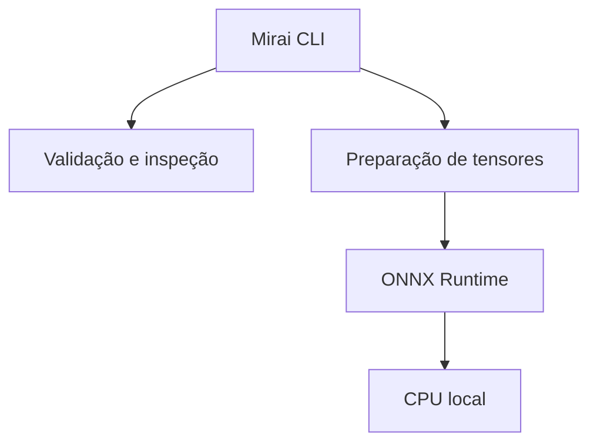

<div align="center">

# 🚀 MiraiOS

### The Future Runs Local

Framework Python enxuto para validar, inspecionar, executar e medir modelos
ONNX em hardware local.

[](https://pypi.org/project/miraios/)
[](https://github.com/start6202783-dotcom/MiraiOS/actions/workflows/ci.yml)
[](pyproject.toml)
[](LICENSE)

[Instalação](#-instalação) •
[Comandos](#-mirai-cli) •
[Entradas](#-entradas-de-modelo) •
[Roadmap](#-roadmap) •
[Contribuição](#-desenvolvimento-e-contribuição)

</div>

---

## 🌐 Sobre

O **MiraiOS** é um projeto open-source do **Projeto Hikari** para simplificar
operações essenciais de Edge AI:

- validar a estrutura de arquivos ONNX;
- inspecionar nomes, tipos e shapes de tensores;
- executar inferências numéricas ou com imagens;
- preparar múltiplas entradas com os tipos esperados pelo modelo;
- medir latência e vazão localmente.

> Execute IA onde os dados são gerados.

Executar modelos localmente pode reduzir latência, preservar privacidade,
permitir operação offline e diminuir a dependência de infraestrutura em nuvem.

---

## 🚧 Status do projeto

| Item | Estado |
| --- | --- |
| Projeto | Hikari |
| Fase | MVP |
| Versão do código | v0.5.1 |
| Distribuição | PyPI |
| Provider atual | ONNX Runtime CPU |
| Licença | MIT |

A v0.5.1 é uma versão de estabilização. A interface pública ainda pode evoluir
durante o MVP, mas os comportamentos documentados são cobertos por testes
automatizados em Python 3.10, 3.11, 3.12 e 3.13.

---

## 🏗️ Arquitetura



O pacote separa a CLI, validação, preparação de entradas, runtime e benchmark
em módulos independentes e testáveis.

### 🧰 Mirai CLI

| Comando | Descrição |
| --- | --- |
| `mirai init` | Confirma que o ambiente do Projeto Hikari está pronto. |
| `mirai validate modelo.onnx` | Carrega o arquivo e executa `onnx.checker`. |
| `mirai info modelo.onnx` | Exibe entradas, saídas, shapes, tipos e nós. |
| `mirai run modelo.onnx --input 5` | Executa uma inferência. |
| `mirai benchmark modelo.onnx` | Mede latência, mediana, P95 e IPS. |

---

## 🚀 Instalação

O MiraiOS requer Python 3.10 ou superior. Recomenda-se utilizar um ambiente
virtual:

```bash
python -m venv .venv
```

Ative o ambiente no Linux ou macOS:

```bash
source .venv/bin/activate
```

No Windows PowerShell:

```powershell
.venv\Scripts\Activate.ps1
```

Instale ou atualize pelo PyPI:

```bash
python -m pip install --upgrade miraios
```

Confirme a instalação:

```bash
mirai --version
```

---

## ⚡ Uso rápido

### Validar de verdade um modelo

```bash
mirai validate seu_modelo.onnx
```

Além de verificar caminho e extensão, o comando carrega o protobuf ONNX e
executa a validação estrutural oficial do formato.

### Inspecionar entradas e saídas

```bash
mirai info seu_modelo.onnx
```

### Executar uma entrada escalar

```bash
mirai run seu_modelo.onnx --input 5.0
```

O valor é convertido para o dtype do modelo e expandido para o shape fixo
esperado. Arrays podem ser fornecidos como JSON:

```bash
mirai run seu_modelo.onnx --input "[[1, 2, 3]]"
```

### Executar múltiplas entradas

Repita `--input` e identifique cada tensor pelo nome apresentado por
`mirai info`:

```bash
mirai run soma.onnx --input x=5 --input y=7
```

Valores posicionais também são aceitos na ordem das entradas do modelo:

```bash
mirai run soma.onnx --input 5 --input 7
```

### Executar uma imagem

```bash
mirai run visao.onnx --input foto.jpg
```

O MiraiOS detecta automaticamente modelos NCHW e NHWC quando o shape não é
ambíguo. Para escolher explicitamente:

```bash
mirai run visao.onnx --input foto.jpg --layout nchw
mirai run visao.onnx --input foto.jpg --layout nhwc
```

Imagens destinadas a tensores de ponto flutuante são convertidas para o
intervalo `[0, 1]`. Entradas `uint8` preservam a escala de pixels.

### Medir desempenho

```bash
mirai benchmark seu_modelo.onnx --runs 100 --warmup 5
```

O benchmark exclui o carregamento do modelo e informa:

- tempo total medido;
- latência média;
- mediana;
- percentil 95;
- inferências por segundo.

O comando aceita as mesmas opções `--input` e `--layout` do `mirai run`:

```bash
mirai benchmark visao.onnx \
  --input foto.jpg \
  --layout nchw \
  --runs 100 \
  --warmup 5
```

---

## 🧩 Entradas de modelo

| Recurso | v0.5.1 |
| --- | --- |
| Escalares numéricos | ✅ |
| Arrays JSON | ✅ |
| Dtype obtido do modelo | ✅ |
| Shapes fixos e dimensões dinâmicas | ✅ |
| Entradas nomeadas | ✅ |
| Múltiplas entradas | ✅ |
| Imagens NCHW | ✅ |
| Imagens NHWC | ✅ |
| Imagens float e `uint8` | ✅ |
| Batch de múltiplas imagens | Ainda não |
| Normalização específica por modelo | Ainda não |
| Providers CUDA e DirectML | Roadmap |

O pré-processamento de visão da v0.5.1 é propositalmente básico. Modelos que
exigem mean/std, letterbox, BGR ou tokenização devem receber tensores já
preparados ou aguardar os perfis de pré-processamento previstos no roadmap.

---

## 🗺️ Roadmap

### Projeto Hikari — estabilização v0.5.1

- [x] Validar a estrutura real com `onnx.checker`.
- [x] Separar CLI, inspeção, entradas, runtime e benchmark.
- [x] Respeitar shapes e tipos informados pelo modelo.
- [x] Suportar entradas nomeadas e múltiplas entradas.
- [x] Corrigir imagens NCHW, NHWC, float e `uint8`.
- [x] Adicionar warm-up, mediana e P95 ao benchmark.
- [x] Adicionar testes automatizados.
- [x] Adicionar CI para Python 3.10–3.13.

### Próximas versões

- [ ] Selecionar providers CUDA e DirectML.
- [ ] Exportar relatórios de benchmark em JSON.
- [ ] Detectar automaticamente o hardware local.
- [ ] Criar perfis configuráveis de pré-processamento.
- [ ] Ampliar e validar compatibilidade com ARM.
- [ ] Adicionar suporte experimental a RISC-V.

---

## 📁 Estrutura do projeto

```text
MiraiOS/
├── .github/workflows/ci.yml
├── examples/
│   └── dummy_model.onnx
├── scripts/
│   └── create_dummy_model.py
├── src/mirai/
│   ├── __init__.py
│   ├── benchmark.py
│   ├── cli.py
│   ├── errors.py
│   ├── inputs.py
│   ├── inspect.py
│   ├── main.py
│   └── runtime.py
├── tests/
├── CHANGELOG.md
├── CONTRIBUTING.md
├── LICENSE
├── pyproject.toml
└── README.md
```

---

## 🧪 Desenvolvimento e contribuição

Clone o repositório e instale as dependências de desenvolvimento:

```bash
git clone https://github.com/start6202783-dotcom/MiraiOS.git
cd MiraiOS
python -m venv .venv
python -m pip install --editable ".[dev]"
```

Execute a suíte:

```bash
python -m pytest
```

As orientações completas estão em [CONTRIBUTING.md](CONTRIBUTING.md).

---

## 📄 Licença

Distribuído sob a licença **MIT**. Consulte [LICENSE](LICENSE).

---

## 🌅 Projeto Hikari

**Hikari** é a primeira etapa do MiraiOS: um MVP para validar os fundamentos de
uma camada portátil entre modelos ONNX e hardware local.

> Pequeno no runtime. Grande no futuro.

---

<div align="center">

**MiraiOS — The Future Runs Local**

Feito para levar a Inteligência Artificial além da nuvem. 🚀

</div>
