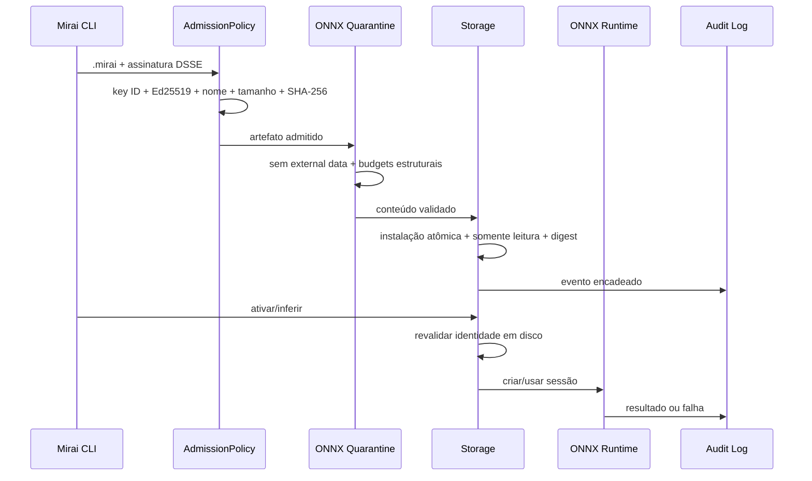

# Projeto Hikari v0.12 — Mirai Shield

## Resumo executivo

A v0.12 coloca uma fronteira verificável entre o upload e o runtime. O Mirai
Shield não tenta provar que qualquer modelo é seguro. Ele garante que o Agent
tenha uma resposta explícita para seis perguntas antes de executar:

1. o artefato veio de uma chave autorizada pela política local?
2. os bytes recebidos correspondem ao nome, tamanho e digest assinados?
3. a estrutura ONNX está dentro dos limites operacionais aceitos?
4. os arquivos persistidos continuam com a mesma identidade?
5. a requisição cabe no orçamento de tempo, fila e concorrência?
6. existe uma trilha verificável da decisão tomada?

O formato `.mirai` continua na versão 1. Assinaturas são destacadas e a
política padrão permanece `open` para preservar os fluxos da v0.11.

## Pipeline de confiança



## 1. Admissão assinada

O Agent possui duas políticas:

| Modo | Comportamento |
| --- | --- |
| `open` | Aceita ONNX e `.mirai`; se uma assinatura for enviada, ela precisa ser válida. |
| `signed` | Aceita somente `.mirai` assinado por uma das chaves públicas configuradas. |

Exemplo:

```bash
mirai key generate release
mirai sign app-1.0.0.mirai --key ~/.mirai/keys/release.key

mirai agent start \
  --admission signed \
  --trust-key ~/.mirai/keys/release.pub

mirai deploy app-1.0.0.mirai \
  --device edge \
  --signature app-1.0.0.mirai.sig
```

O envelope DSSE liga o tipo do payload ao conteúdo assinado. O payload liga
nome original, tamanho e SHA-256 do artefato. A chave pública é identificada
por digest; chaves desconhecidas, arquivos grandes, base64 inválido, assinatura
ausente ou digest divergente são recusados.

O trust store é deliberadamente local e explícito. Não existe descoberta
automática de chaves, confiança no primeiro uso ou download de chave pela
mesma conexão usada para o deploy.

## 2. Quarentena estrutural ONNX

O carregamento usa `load_external_data=False`. Modelos que declaram dados
externos são recusados, inclusive em atributos e subgrafos. Antes do
`onnx.checker` e da criação de sessão, o modelo recebe limites para:

- arquivo vazio ou maior que 512 MB;
- profundidade de subgrafos maior que 16;
- mais de 100.000 nós;
- rank de tensor maior que 16;
- mais de 100 milhões de elementos estáticos por tensor;
- mais de 512 MB declarados em inicializadores;
- dimensões negativas, inválidas ou com multiplicação fora do orçamento.

O relatório de quarentena acompanha o deployment. Esses limites impedem
classes conhecidas de consumo acidental ou malicioso antes do runtime, mas não
substituem isolamento de processo e limites do sistema operacional.

## 3. JSON estrito

As fronteiras novas compartilham um único codec:

- UTF-8 estrito;
- nomes de objeto únicos;
- `NaN`, `Infinity` e `-Infinity` proibidos;
- profundidade máxima 64;
- orçamento de nós e tamanho de strings;
- serialização com números não finitos proibidos;
- bytes canônicos quando um digest precisa ser reproduzido.

Isso evita que parser, assinatura, registro e API atribuam significados
diferentes aos mesmos bytes.

## 4. Armazenamento e integridade em uso

Escritas de estado usam temporários criados com exclusividade, `O_NOFOLLOW`
quando disponível, `fsync` do arquivo, troca atômica e sincronização do
diretório pai. O digest estável confirma que dispositivo, inode, tamanho,
`mtime` e `ctime` não mudaram durante a leitura.

Modelos e pacotes são instalados por digest e recebem modo somente leitura em
sistemas compatíveis. Antes de ativar ou inferir, o Agent compara o arquivo em
disco ao tamanho e SHA-256 registrados. Um cache de metadados evita recalcular
o hash quando nenhum atributo observável mudou; qualquer mudança invalida o
cache e força a verificação completa.

## 5. Auditoria encadeada

`audit.jsonl` possui registros com versão, sequência, hash anterior, evento e
hash do registro canônico. `audit.jsonl.head` mantém quantidade e head em uma
troca atômica separada. A verificação detecta:

- edição de evento;
- remoção ou reordenação no meio da cadeia;
- divergência de hash anterior;
- truncamento em relação ao checkpoint;
- campos extras e JSON ambíguo;
- arquivo ou registro acima do limite.

O fluxo tolera exatamente o caso de queda entre anexar um registro e atualizar
o checkpoint. O endpoint autenticado `GET /v1/audit` devolve validade,
quantidade, head e eventos recentes. `mirai doctor` verifica a cadeia.

O log é resistente a adulteração, não inviolável: quem controla o sistema como
administrador pode reescrever log e checkpoint. A próxima etapa é ancorar o
head em outro sistema ou serviço de transparência.

## 6. Orçamento de recursos e superfície HTTP

O servidor continua pequeno e sem framework, mas agora aplica:

- timeout de 15 segundos por socket;
- fila de escuta limitada a 64;
- até 32 requisições simultâneas;
- duas operações pesadas simultâneas por padrão;
- erro `503` quando o orçamento de trabalho foi esgotado;
- limite de corpo específico por endpoint;
- métodos não usados recusados;
- `Server: MiraiOS`, sem versão do Python;
- `Cache-Control: no-store`, CSP, `nosniff` e política de referrer.

Esses controles são defesa em profundidade para laboratório e rede privada.
`http.server` não é um servidor recomendado para produção.

## Evidência de qualidade

A suíte possui 1.239 casos pytest:

- 180 testes herdados dos marcos anteriores;
- 30 cenários diretos do Mirai Shield;
- 1.024 casos hostis determinísticos em JSON, nomes, pareamento e assinatura;
- 5 testes de propriedade com cerca de 900 exemplos reproduzíveis.

O CI testa Python 3.10–3.13 em x86-64, repete a suíte em ARM64 Linux e executa
Ruff, mypy, Bandit, auditoria de dependências e cobertura de branches com piso
de 75%. Actions de terceiros usam SHA completo e o Dependabot acompanha
GitHub Actions e dependências Python.

## Compatibilidade e migração

- `.mirai` permanece no formato v1;
- Agents antigos continuam legíveis, e `events.jsonl` é preservado como
  histórico legado;
- o modo padrão `open` mantém deploys ONNX e `.mirai` da v0.11;
- `signed` precisa ser habilitado explicitamente e exige pelo menos uma chave;
- CUDA e DirectML continuam sendo seleção de provider, não certificação de
  hardware;
- RISC-V e plugins de runtime permanecem experimentais.

## Limites conhecidos

- nenhuma sandbox de processo, seccomp, namespace ou cgroup;
- nenhum mTLS, CA, HSM, KMS ou rotação automática de chave de assinatura;
- nenhuma ancoragem externa do head da auditoria;
- nenhum protocolo completo TUF ou Uptane;
- nenhuma exposição direta à internet;
- nenhum certificado de segurança ou garantia de ausência de vulnerabilidades.

Veja [o modelo de ameaças](threat-model.md) e
[a pesquisa de engenharia](research/0001-mirai-shield.md).
