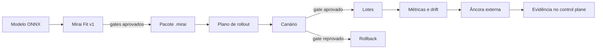

# Projeto Hikari v0.13 — Operação verificável em escala

## Resumo executivo

A v0.13 transforma capacidades isoladas do MiraiOS em um ciclo operacional
controlado. O objetivo não é adicionar um grande número de formatos ou
runtimes; é permitir que a mesma entrega seja selecionada, testada, promovida,
observada e auditada em mais de um dispositivo sem perder as garantias das
versões anteriores.

Os quatro pilares deste marco são:

1. **controle de frota:** tags, seletores, canário, lotes, gates e rollback;
2. **auditoria externa:** checkpoints fora do Agent e prova de extensão;
3. **observabilidade:** métricas limitadas, Prometheus e sinais de drift;
4. **Mirai Fit v1:** variante INT8 gerada, comparada e aprovada no control
   plane antes de ser publicada.

O Creator Node, o Mirai Benchmark Arena, uma distribuição Linux própria e
produtos voltados ao público permanecem fora deste repositório e deste marco.

## Fluxo operacional



Nenhum desses passos altera silenciosamente um modelo dentro do Agent. O
Mirai Fit cria um novo pacote; o rollout é somente um plano até receber
`--apply`; o Agent continua validando e admitindo o artefato normalmente.

## 1. Seleção da frota

O registro de dispositivos passa ao schema v4 e aceita até 32 tags no formato
`chave=valor`. Chaves são normalizadas para minúsculas; valores são
case-sensitive. Tags devem ser inventário não secreto.

```bash
mirai device tag edge-01 --set env=prod --set region=br --set group=cameras
mirai device tag edge-02 --set env=prod --set region=br --set group=cameras
mirai device tag edge-02 --remove group

mirai fleet status --selector env=prod,region=br
```

Um seletor é uma conjunção: todas as condições precisam conferir. A ordem dos
dispositivos selecionados é sempre lexical por nome, o que torna o plano
reproduzível. A v0.13 não implementa expressões com `OR`, negação ou regex.

## 2. Rollout progressivo

O comando abaixo valida o artefato e grava um plano, mas não toca em nenhum
Agent:

```bash
mirai fleet rollout app-2.0.0.mirai \
  --selector env=prod,region=br \
  --canary 10 \
  --batch-size 5 \
  --max-failure-rate 0
```

Depois de revisar `.mirai/rollouts/RUN_ID.json`, a execução exige confirmação
explícita:

```bash
mirai fleet rollout app-2.0.0.mirai \
  --selector env=prod,region=br \
  --canary 10 \
  --batch-size 5 \
  --max-failure-rate 0 \
  --workers 4 \
  --apply
```

### Semântica do gate

- o canário contém pelo menos um dispositivo;
- os demais dispositivos são divididos em lotes determinísticos;
- cada dispositivo executa o fluxo `validate → doctor → deploy → activate →
  inference` já usado pelo `mirai launch`;
- depois de cada lote, a taxa cumulativa de falhas é comparada a
  `max_failure_rate`;
- ultrapassar o limite interrompe lotes futuros e restaura, em ordem inversa,
  todas as ativações concluídas durante a execução;
- uma falha de rollback fica explícita no status `rollback_failed`.

O rollback restaura a ativação anterior ou desativa o primeiro candidato. O
deployment novo pode permanecer inativo para investigação e pode ser removido
depois com a política de retenção já existente.

O relatório não armazena os valores de `--input`. Ele registra política,
artefato, assinatura, lotes, timestamps, resultado por dispositivo, itens
ignorados e evidência de rollback.

## 3. Ancoragem externa da auditoria

O endpoint `/v1/audit` agora aceita um checkpoint anterior:

```text
GET /v1/audit?from_records=N&from_head=SHA256
```

O Agent só responde quando sua cadeia atual estende exatamente esse head. A
resposta contém sequência, hash anterior e hash de cada registro novo. O
control plane confere a continuidade antes de aceitar outro checkpoint.

```bash
mirai audit anchor --device edge-01
mirai fleet anchor --selector env=prod --workers 4
```

O ledger padrão fica em `.mirai/control-plane/anchors.jsonl`, protegido pela
mesma cadeia SHA-256 e checkpoint durável da auditoria do Agent. Chamadas de
rede são paralelas; a escrita no ledger é serializada e revalidada para evitar
perda de atualização concorrente.

O Agent local também mantém um `agent_id` persistente. Seu certificado só é
usado quando HTTPS está ativo, mas a identidade permanece estável se o mesmo
diretório de dados migrar de localhost para uma rede pareada.

### Garantia e limite

Depois que um head foi ancorado, truncar ou reescrever a cadeia do Agent sem
preservar esse head é detectado. Isso eleva o custo de adulteração no
dispositivo, mas não é transparência pública: um invasor que controla ao mesmo
tempo o Agent e o control plane local pode reescrever ambos. Para essa ameaça,
exporte ou assine o ledger em um sistema administrativamente independente.

Cada prova aceita no máximo 10.000 registros novos. Uma operação que produza
mais eventos deve ancorar com maior frequência.

## 4. Observabilidade com privacidade

O Agent oferece três superfícies autenticadas com papel mínimo `viewer`:

| Endpoint | Conteúdo |
| --- | --- |
| `/v1/metrics` | contadores, erro, mediana, P95, persistência e drift |
| `/v1/drift` | somente os sinais heurísticos por deployment |
| `/metrics` | métricas numéricas no formato Prometheus 0.0.4 |

```bash
mirai fleet observe --selector env=prod --workers 8
```

São persistidos:

- quantidade de deployments, ativações, inferências e falhas;
- até 200 latências recentes por deployment;
- até 200 médias numéricas das saídas recentes.

Não são persistidos nomes de campos da saída, entradas, imagens, arrays
originais nem resultados completos. Estruturas com mais de 10.000 valores não
geram sinal de saída. Os contadores em memória são sincronizados a cada dez
inferências, após cinco segundos de atividade ou no encerramento limpo. Se o
disco falhar, o endpoint marca a persistência como `degraded`, mas uma
inferência já concluída continua sendo devolvida ao cliente.

### Sinal de drift

Depois de 40 amostras, as primeiras 20 da janela retida formam o baseline e as
20 mais recentes formam a janela atual. O score é:

```text
abs(média_atual - média_baseline)
────────────────────────────────
max(abs(média_baseline), desvio_baseline, 1e-9)
```

Score maior ou igual a `0.50` vira `warning`. Esse cálculo é um alerta
operacional conservador. Ele não mede acurácia, não conhece o rótulo correto e
não comprova concept drift.

## 5. Mirai Fit v1

O Fit v1 reduz pesos compatíveis para Dynamic INT8 no control plane:

```bash
mirai fit modelo.onnx \
  --name app-int8 \
  --package-version 1.0.0 \
  --output app-int8-1.0.0.mirai \
  --input '[[1.0, 2.0, 3.0, 4.0]]' \
  --max-absolute-error 0.05 \
  --min-speedup 1.0 \
  --runs 50 \
  --warmup 3
```

Com assinatura:

```bash
mirai fit modelo.onnx \
  --name app-int8 \
  --package-version 1.0.0 \
  --output app-int8-1.0.0.mirai \
  --sign-key ~/.mirai/keys/release.key
```

O control plane:

1. valida o ONNX de origem;
2. cria a variante Dynamic INT8 em staging;
3. valida novamente a variante;
4. executa origem e candidata com a mesma entrada;
5. compara shapes, finitude e erro absoluto/relativo;
6. mede P95 das duas sessões no provider CPU;
7. grava sempre um relatório `.fit.json`;
8. publica e opcionalmente assina o `.mirai` somente se os dois gates passam.

A publicação é transacional. Em `--replace`, artefatos anteriores são movidos
para backup temporário e restaurados se o commit falhar. Uma candidata
rejeitada preserva o pacote conhecido como funcional.

### Limites do Fit v1

- somente quantização dinâmica de pesos INT8;
- benchmark executado no hardware do control plane, registrado no relatório;
- uma entrada de teste não representa a distribuição real do produto;
- o gate não certifica acurácia, robustez ou adequação regulatória;
- ARM, CUDA, NPU, quantização estática e calibração exigem validação futura em
  hardware real.

Por isso, trate o resultado como uma variante candidata verificada, não como
uma otimização universal.

## Compatibilidade

- CLI e Agent passam à série `0.13` e continuam exigindo a mesma série minor;
- Mirai Package permanece no formato v1;
- registros de dispositivos v1, v2 e v3 são lidos e migrados ao salvar;
- Hikari Link, lifecycle, Mirai Pilot e Mirai Shield mantêm seus contratos;
- admissão `open` permanece padrão; rollout de pacote assinado aceita o
  envelope destacado com `--signature`.

## Evidência de qualidade

A validação local desta implementação contém 1.371 testes, dos quais 132
exercitam diretamente a v0.13. Os cenários incluem concorrência, falha
parcial, rollback e rollback quebrado, adulteração de checkpoint, corrupção de
estado, privacidade de saída, limites de memória, drift, quantização,
assinatura e restauração transacional.

O projeto mantém gates de Ruff, mypy, Bandit, `pip-audit`, Python 3.10–3.13,
ARM64 no CI e cobertura de branches mínima de 75%.
