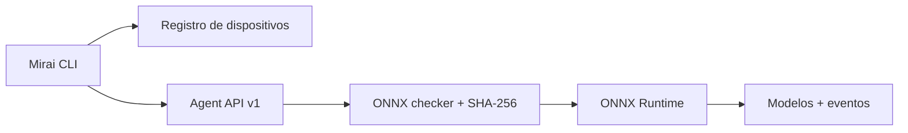

# Projeto Hikari v0.6 — Mirai Agent

A v0.6 é o primeiro passo do MiraiOS além da execução no computador da CLI.
Ela introduz um destino independente que recebe, verifica e registra modelos
ONNX por meio de uma API local.

## Objetivo

Permitir que um modelo saia do ambiente do desenvolvedor e seja implantado em
outro ambiente Linux com comandos reproduzíveis:

```bash
mirai device add local --url http://127.0.0.1:8080
mirai deploy examples/dummy_model.onnx --device local
mirai logs --device local
```

O primeiro dispositivo pode ser um container no mesmo computador. A separação
entre CLI e Agent preserva o protocolo que será usado posteriormente em ARM64,
placas físicas e outros runtimes.

## Arquitetura



## Protocolo mínimo

| Endpoint | Operação |
| --- | --- |
| `GET /v1/health` | Verifica se o Agent está ativo. |
| `GET /v1/info` | Retorna sistema, arquitetura e providers. |
| `POST /v1/deployments` | Recebe e valida um modelo ONNX binário. |
| `GET /v1/logs?limit=20` | Retorna eventos recentes. |

O upload utiliza os cabeçalhos `X-Mirai-Model-Name` e `X-Mirai-SHA256`.
O Agent só confirma o deployment após:

1. receber o tamanho declarado;
2. comparar o SHA-256;
3. validar a estrutura ONNX;
4. abrir o modelo no ONNX Runtime do dispositivo;
5. persistir o modelo e registrar o evento.

## Simulação com Docker

Inicie o dispositivo:

```bash
docker compose up --build -d
```

Cadastre e examine o Agent:

```bash
mirai device add local --url http://127.0.0.1:8080
mirai device info local
```

Crie o modelo de exemplo, faça o deploy e consulte os eventos:

```bash
python scripts/create_dummy_model.py
mirai deploy examples/dummy_model.onnx --device local
mirai logs --device local
```

Encerre a simulação:

```bash
docker compose down
```

O volume `mirai-agent-data` preserva modelos e eventos entre reinicializações.

## Limites de segurança

Esta é uma API local de desenvolvimento. Ela não implementa autenticação,
criptografia própria, autorização por modelo ou execução remota de inferência.

- Por padrão, `mirai agent start` escuta apenas em `127.0.0.1`.
- O Compose publica a porta apenas no localhost do computador.
- Não exponha a porta 8080 diretamente à internet.
- A autenticação e o pareamento seguro serão requisitos antes de dispositivos
  remotos fora de uma máquina de desenvolvimento.

## Critério de conclusão

A v0.6 está validada quando o mesmo fluxo funciona:

1. nos testes integrados em processo;
2. em um Agent iniciado manualmente;
3. no container fornecido pelo repositório.

Nenhuma placa física é necessária para desenvolver este marco.
