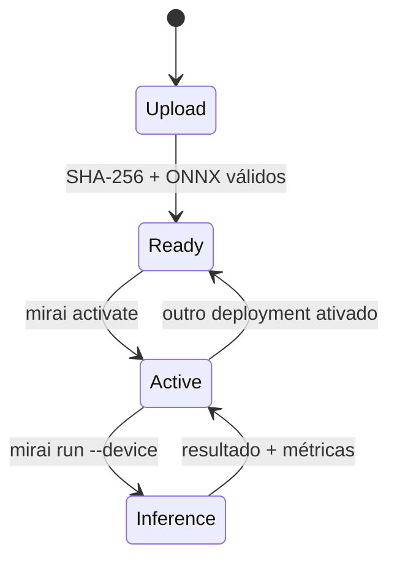

# Projeto Hikari v0.7 — lifecycle e inferência remota

A v0.7 transforma o Mirai Agent em um destino de execução. Um modelo não
apenas chega ao dispositivo: ele passa por um lifecycle explícito, pode ser
ativado e recebe inferências pela mesma CLI usada no computador do
desenvolvedor.

## Objetivo

Completar o primeiro fluxo operacional do MiraiOS:

```text
modelo ONNX → deploy → ready → active → inference → resultado + evento
```

O dispositivo pode ser o próprio computador ou um container Linux. Isso
permite desenvolver o protocolo sem exigir uma Raspberry Pi ou outra placa
física.

## Fluxo completo

Inicie o Agent:

```bash
mirai agent start
```

Em outro terminal, cadastre o destino e envie o modelo de exemplo:

```bash
mirai device add local --url http://127.0.0.1:8080
mirai deploy examples/dummy_model.onnx --device local
mirai status --device local
```

O deploy informa um identificador derivado do SHA-256. Para o arquivo de
exemplo versionado no repositório:

```bash
mirai activate 153f2947c78a0313 --device local
mirai run --device local --input 5.0
mirai logs --device local
```

O resultado esperado da inferência é `6.0`.

## Lifecycle



Somente um deployment fica ativo por Agent. Ativar outro modelo devolve o
anterior ao estado `ready`. O registro e a seleção ativa são persistidos em
disco e sobrevivem à reinicialização do processo.

## API do Agent v1

| Método e endpoint | Operação |
| --- | --- |
| `GET /v1/health` | Verifica se o Agent está respondendo. |
| `GET /v1/info` | Retorna sistema, arquitetura, CPU, memória e providers. |
| `POST /v1/deployments` | Recebe, verifica e valida um modelo ONNX. |
| `GET /v1/deployments` | Lista deployments e identifica o ativo. |
| `POST /v1/deployments/{id}/activate` | Ativa um deployment pronto. |
| `POST /v1/inferences` | Executa o deployment ativo. |
| `GET /v1/logs?limit=20` | Retorna eventos recentes. |

O endpoint de inferência aceita entradas numéricas, arrays JSON e entradas
nomeadas no mesmo formato de `mirai run`. A resposta inclui resultado,
latência de inferência e tempo total no Agent.

## Persistência

O diretório informado por `--data-dir` contém:

| Item | Finalidade |
| --- | --- |
| `models/` | Modelos validados, identificados pelo hash. |
| `deployments.json` | Lifecycle e deployment ativo. |
| `events.jsonl` | Deploys, ativações e inferências em ordem temporal. |

As gravações do registro de deployments usam substituição atômica para evitar
estado parcialmente escrito.

## Limites de segurança

A API da v0.7 continua sendo um ambiente local de desenvolvimento.

- O Agent escuta somente em `127.0.0.1` por padrão.
- O upload de modelos é limitado a 512 MB.
- Corpos JSON são limitados a 1 MB.
- Imagens remotas são rejeitadas nesta versão; use valores numéricos ou arrays
  JSON. Imagens continuam disponíveis na execução local.
- Não exponha a porta do Agent diretamente à internet.
- Pareamento, autenticação e autorização são requisitos da próxima etapa antes
  de uso em redes não confiáveis.

## Critério de conclusão

A v0.7 está validada quando:

1. o modelo chega ao Agent com SHA-256 verificado;
2. o deployment transita de `ready` para `active`;
3. a seleção ativa sobrevive à reinicialização do Agent;
4. a inferência retorna o resultado esperado pela CLI;
5. latência, tempo total e eventos podem ser consultados;
6. o fluxo passa nos testes de Python 3.10 a 3.13.

