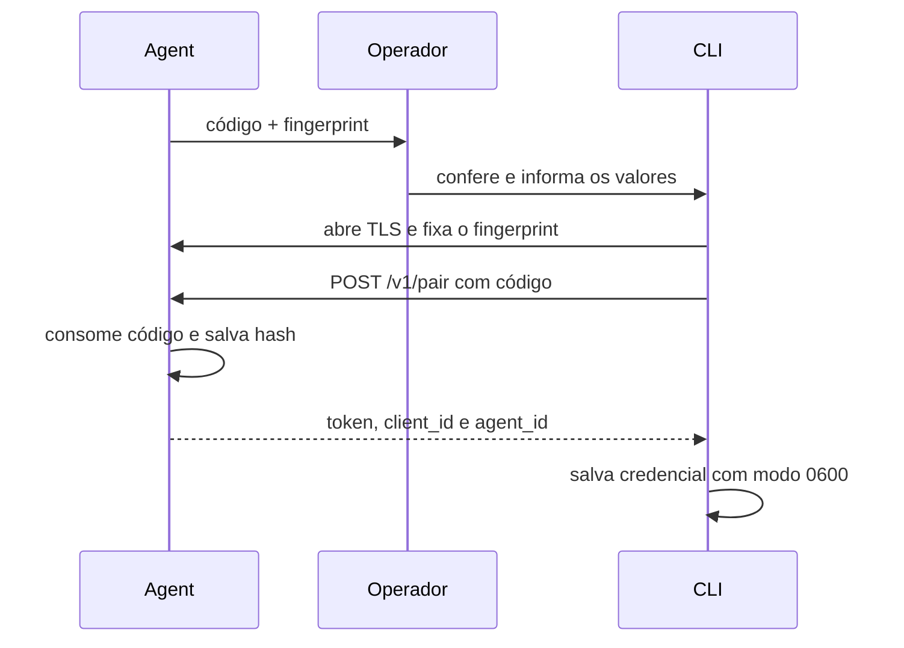

# Projeto Hikari v0.8 — Hikari Link

A v0.8 transforma o Mirai Agent de um serviço estritamente local em um
destino que pode ser operado em uma rede privada com identidade verificável,
autenticação por cliente e revogação.

O objetivo não é criar uma plataforma de identidade completa. É estabelecer
uma base pequena e auditável para que código, modelos e resultados não
trafeguem por uma conexão de rede sem proteção.

## Propriedades do protocolo

O Hikari Link entrega cinco propriedades:

1. **Identidade persistente:** cada Agent cria um identificador, uma chave RSA
   e um certificado X.509 autoassinado.
2. **Confirmação fora de banda:** a CLI só confia no certificado cujo
   fingerprint SHA-256 foi conferido no terminal do Agent.
3. **Pareamento efêmero:** um código aleatório de 12 caracteres fica em
   memória, expira em dez minutos e é consumido uma única vez.
4. **Credencial por cliente:** cada pareamento cria um token aleatório
   independente. O Agent armazena apenas seu hash SHA-256.
5. **Revogação:** um cliente autenticado pode revogar o próprio token sem
   alterar a identidade ou as credenciais dos demais.

TLS exige versão 1.2 ou superior. O certificado inclui `localhost`,
`127.0.0.1` e `::1`, mas a confiança do cliente é definida pelo fingerprint,
não por uma autoridade certificadora ou pelo hostname.

## Modos de execução

| Escuta do Agent | Canal | Autenticação |
| --- | --- | --- |
| `127.0.0.1`, `::1` ou `localhost` | HTTP | dispensada |
| Loopback com `--secure` | HTTPS | obrigatória |
| Qualquer endereço fora de loopback | HTTPS automático | obrigatória |

Esse limite mantém o desenvolvimento local simples e impede que o mesmo modo
sem autenticação seja ativado acidentalmente em `0.0.0.0` ou em um IP da rede.
A CLI também recusa credenciais em HTTP e recusa Agents não pareados fora de
localhost.

## Fluxo de pareamento



O fingerprint é comparado imediatamente após o handshake TLS e antes de
qualquer requisição HTTP. Uma divergência fecha a conexão sem transmitir o
código ou um token.

Exemplo:

```bash
# No dispositivo
mirai agent start --host 0.0.0.0

# No computador do operador
mirai device pair edge \
  --url https://192.168.1.40:8080 \
  --code CODIGO-EXIBIDO \
  --fingerprint SHA256-EXIBIDO

mirai doctor --device edge
```

O código deixa de funcionar assim que o pareamento termina. Reiniciar o Agent
gera outro código sem alterar o certificado ou invalidar clientes existentes.

## Superfície HTTP

No modo seguro, os endpoints são divididos assim:

| Endpoint | Autenticação | Função |
| --- | --- | --- |
| `GET /v1/health` | pública | disponibilidade e modo de segurança |
| `POST /v1/pair` | código efêmero | cria um cliente |
| `GET /v1/info` | bearer token | inventário do dispositivo |
| `GET /v1/deployments` | bearer token | estado dos deployments |
| `POST /v1/deployments` | bearer token | deploy verificado |
| `POST /v1/deployments/{id}/activate` | bearer token | ativação |
| `POST /v1/inferences` | bearer token | inferência |
| `GET /v1/logs` | bearer token | eventos recentes |
| `GET /v1/clients` | bearer token | clientes pareados sem hashes |
| `DELETE /v1/clients/self` | bearer token | revoga o próprio cliente |

Todas as respostas JSON usam `Cache-Control: no-store` e
`X-Content-Type-Options: nosniff`.

## Dados persistentes

No Agent:

| Arquivo | Conteúdo | Permissão pretendida |
| --- | --- | --- |
| `agent-key.pem` | chave privada RSA | `0600` |
| `agent-cert.pem` | certificado público | `0644` |
| `identity.json` | ID, fingerprint e criação | `0600` |
| `clients.json` | IDs, nomes, datas e hashes | `0600` |

Na CLI, `~/.mirai/devices.json` contém o token necessário para autenticação e
usa `0600` em plataformas compatíveis. O arquivo deve ser protegido como
qualquer credencial local.

## Diagnóstico

`mirai doctor --device NOME` verifica em uma operação:

- conexão e health check;
- HTTPS e fingerprint configurado;
- autenticação;
- compatibilidade entre a série `major.minor` da CLI e do Agent;
- providers do runtime;
- quantidade de deployments e modelo ativo.

## Modelo de ameaças

A v0.8 protege contra:

- interceptação passiva do tráfego na rede;
- envio de segredo a um servidor com fingerprint diferente;
- uso dos endpoints protegidos sem uma credencial válida;
- recuperação direta do token a partir do registro do Agent;
- reutilização do código após pareamento ou expiração;
- manutenção de acesso após revogação.

A v0.8 não pretende proteger contra:

- comprometimento do sistema operacional do Agent ou da máquina da CLI;
- um operador que confirme um fingerprint adulterado;
- indisponibilidade, varredura ou tentativa ilimitada de pareamento;
- roubo do token no arquivo local ou na memória do processo;
- administração granular por papéis;
- exposição segura e autônoma à internet pública.

Por isso, o Agent deve permanecer em uma rede privada, atrás de firewall. Uma
etapa futura deve adicionar limitação de tentativas, rotação de identidade e
políticas de autorização antes de ampliar essa fronteira.

## Critérios de validação

A v0.8 está validada quando:

1. o certificado, o ID e os clientes continuam válidos após reinício;
2. uma CLI com fingerprint incorreto não envia uma requisição;
3. endpoints protegidos rejeitam token ausente, falso ou revogado;
4. o código expira, não é persistido e funciona uma única vez;
5. o token não aparece no registro do Agent;
6. `pair → doctor → deploy → activate → run → revoke` funciona via HTTPS;
7. o fluxo local da v0.7 continua compatível em loopback;
8. a suíte passa nas versões de Python suportadas pelo projeto.
