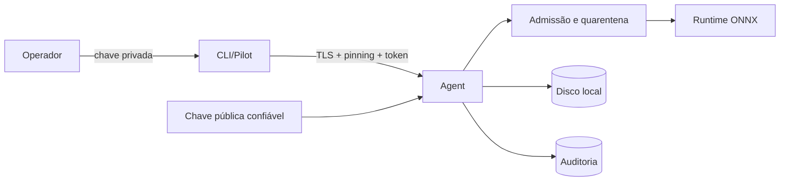

# Modelo de ameaças do MiraiOS v0.12

## Escopo

Este documento descreve o que a v0.12 protege, o que somente detecta e o que
permanece fora do escopo. O cenário recomendado é um Agent em localhost ou em
rede privada controlada, operado por pessoas que conseguem confirmar um
fingerprint e distribuir uma chave pública por canal confiável.

## Ativos

- chave privada de assinatura no computador de release;
- chave privada TLS e tokens do Agent;
- pacotes, modelos, contratos e deployments ativos;
- entradas e resultados de inferência;
- registros de clientes, lifecycle e auditoria;
- disponibilidade de CPU, memória e disco do dispositivo.

## Fronteiras

| Fronteira | Dados não confiáveis | Controle principal |
| --- | --- | --- |
| Rede | URL, headers, JSON, uploads | TLS, pinning, token, RBAC, limites, JSON estrito |
| Artefato | `.mirai`, ONNX, DSSE | assinatura exigível, SHA-256, schema, quarentena |
| Runtime | grafo e tensores | budgets estruturais e concorrência limitada |
| Disco | estado anterior ou alterado | escrita atômica, permissões, digest em uso |
| Auditoria | edição/reordenação/truncamento | hash chain e checkpoint |

## Ameaças tratadas

- intermediário de rede sem o certificado fixado;
- reutilização, força bruta limitada ou revogação de credenciais;
- cliente autenticado operando acima do papel recebido;
- pacote não assinado em Agent com política `signed`;
- assinatura por chave desconhecida ou ligada a outro arquivo;
- path traversal, link, arquivo extra e colisão de nomes;
- JSON ambíguo, não finito, profundo ou volumoso;
- ONNX com external data ou estrutura acima dos budgets;
- arquivo alterado entre validação, ativação e inferência;
- escrita parcial ou colisão de temporário;
- edição, reordenação e truncamento comum da auditoria;
- rajada de requisições ou operações pesadas acima dos limites locais.

## Ameaças parcialmente tratadas

| Ameaça | Mitigação atual | Risco residual |
| --- | --- | --- |
| Exaustão de recursos pelo modelo | limites estruturais e de concorrência | um operador ONNX válido ainda pode ser caro |
| Compromisso do dispositivo | permissões, hashes e auditoria | administrador/root pode substituir processo, chaves e checkpoint |
| Compromisso da chave de release | trust store explícito | não há expiração, revogação distribuída ou threshold |
| Decodificador vulnerável | allowlist, limites e validação | Pillow, NumPy e ONNX são dependências complexas |
| Negação de serviço na rede | timeout, fila e semáforos | não há proxy dedicado, rate limit geral ou proteção volumétrica |

## Fora do escopo da v0.12

- internet pública e ambiente multi-tenant hostil;
- isolamento forte entre modelos;
- código Python ou plugins não confiáveis;
- proteção contra administrador/root já comprometido;
- confidencialidade de modelo contra o dono do dispositivo;
- custódia profissional de chaves, HSM/KMS ou assinatura threshold;
- implementação compatível completa com TUF/Uptane;
- certificação de segurança ou prova formal.

## Regras operacionais

1. Mantenha a chave privada de release fora do Agent.
2. Entregue a chave pública e o fingerprint por canal independente.
3. Use `--admission signed` em pilotos que exigem proveniência.
4. Restrinja a porta por firewall e nunca faça port forwarding público.
5. Execute o Agent com usuário sem privilégios e diretório exclusivo.
6. Colete periodicamente o head de `/v1/audit` em outro sistema.
7. Atualize dependências após os gates e testes do projeto.
8. Trate CUDA, DirectML, plugins e RISC-V como experimentais até validação real.

## Próximas reduções de risco

- subprocesso dedicado por runtime com limites de memória/CPU e watchdog;
- mTLS e rotação com recuperação testada;
- metadados de expiração, revogação e threshold inspirados em TUF;
- ancoragem externa e assinatura periódica do head da auditoria;
- fuzzing contínuo dos parsers e corpus de modelos malformados;
- proxy de produção ou serviço assíncrono endurecido antes de qualquer uso
  fora de rede privada.
